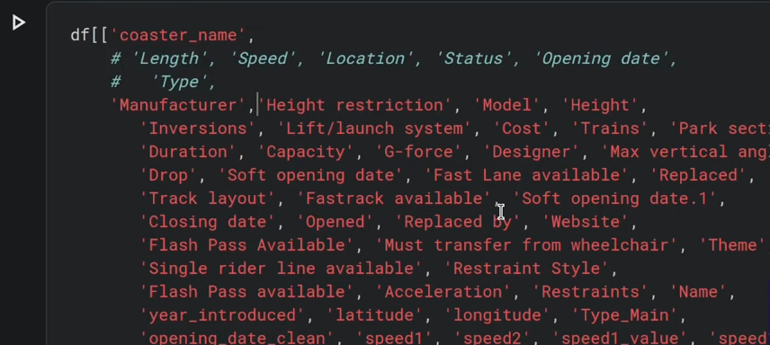

## Prerequisites  

### 

1. 데이터 획득 (Importing a working dataset)
2. 데이터 파악 
    - 일변량 (단수변수에 대한 변화) / 다변량 (복수변수의 변화)
    - Summary statistics (기초 통계량, non-graphic) / graphic (시각화)
3. 데이터 변환
4. 모델 적용 (ML)
5. 모델 평가 


</bar>

### VSCode with Jupyter extensions
https://code.visualstudio.com/docs/datascience/overview  
VSCode 에 Jupyter extensions 설치하고,  
해당 프로젝트를 github repo 에 저장  

```$ python3 -m venv .venv``` 을 이용해서 virtual 환경 설치   
```$ source .venv/bin/activate``` 으로 virtual 환경 실행   
```(.venv)$ pip install ipykerne``` 으로  Jupyter kernel 설치  
```(.venv)$ pip install pandas```으로 관련 python 모듈 설치  

### Jupyter lab (notebook)
https://github.com/jupyterlab/jupyterlab
```bash
$ pip install ipython
# or $ pip install jupyter (or notebook)
$ pip install jupyterlab
$ jupyter lab  
# or $ jupyter notebook 
```
git extension : ```pip install --upgrade jupyterlab jupyterlab-git```

### Other Jupyter 
> 1. [Anaconda](https://www.anaconda.com/) 을 설치해서 Jupyter Notebook 사용  (Local)  
> 2. [google colab](https://colab.research.google.com), [Kaggle](https://www.kaggle.com), [dacon](https://dacon.io/) 에서 제공하는 cloud 커널 을 사용  (Cloud)  

</br>

### Jupyter shortcuts

</br>

### VSCode shortcuts

</br>

### Kaggel 

kaggle 은 Data Science 을 배우기 위한 사이트 

- https://www.kaggle.com/ - google account
- https://dacon.io/ - 국내 사이트

</br>

### Importing a working dataset
kaggle API [^kaggleAPI]

```$ pip install kaggle``` 으로 kaggel API 설치  
Kaggle API TOKEN을 ~/.kaggle/kaggle.json 에 다운로드,  
kaggle API 을 이용하여 data 다운로드 가능   
```bash
# titanic competitions 에서 아래 명령어를 copy 해서 실행
$ kaggle competitions download -c titanic -p /path/to/dest
Downloading titanic.zip to /Users/myoungjunesung/pyproject/data
0%|                                                    | 0.00/34.1k [00:00<?, ?B/s]
100%|██████████████████████████████████████████████████| 34.1k/34.1k [00:00<00:00, 841kB/s]
```
적당한 곳에 압축을 풀어서 jupyter nb cell 에서 load  

```python
import pandas as pd

df = pd.read_csv('./content/titanic/test.csv')
```

> pd 말고 다른 모듈로 로딩하는 경우도 있다. 

## Understanding the big picture

### EDA

- raw data 의 description, dictionary 를 통해 데이터의 각 column들과 row의 의미를 이해
- 결측치 처리 및 데이터필터링
    - 분석 시 필요한 데이터가 수치형 데이터(numerical data)인데 범주형(categorical data)으로 되어 있다면 (데이터 타입이 ‘object’로 뜸) 수치형으로 변환(ex. astype 활용)해줘야 한다.
- 이해하기 쉬운 시각화

https://www.youtube.com/watch?v=xi0vhXFPegw  
https://datascienceschool.net/intro.html 

```python
import pandas as pd

df = pd.read_csv('./content/titanic/test.csv')

df.shape
df.head()
df.tail()
df.discribe()   # 전체적인 통계치
df.info()
df.columns      # 각 columns 을 보기 
```

indexing
```python
df[row index : row index -1]  row 출력
df['row label' : 'row label']   lable row 출력

df['column label']  column label 으로 생각함 (row label 은 오류)
df[['column label','column label_2']]
df.column_label

# selction by lable 
df.loc['row label']
df.loc[['row lable','column label_2']]        # df
df.loc[ : , 'column label']  # row label 생략 불가
...
df.loc['row label' : 'row label' , 'column label' : 'column label']  # 연속
df.loc[['row lable','row lable'],['colum lable','column lable']]     # 불연속

# selection by position 
df.iloc[row index]
df.iloc[[row index, row index_2]]         # df
df.iloc[ : , column index]   # row index 생략불가
...
df.iloc[row index : row index-1 , column index : column index -1 ]
df.iloc[[row index, rowindex],[row index, row index]]

```

```df[[ 'column lable','column lable', ... ]]``` 을 이용한 column selecting 예  


Useful properties and functions in Pandas

```python
#수치화모듈
import numpy as np
import pandas as pd
#pd.set_option('max_columns'=200)

#시각화 모듈
import matplotlib.pylab as plt
import seaborn as sns
plt.style.use('ggplot')

.mean() # 평균
.median() # 중앙값
.mode() # 최빈값

plt.hist(titanic.Fare, bin = 5, edgecolor = 'gray') # 히스토그램
plt.xlable('Fare')
plt.ylable('Frequency')
plt.show()

sns.kdeplot(titanic['Fare'])
plt.show()

plt.boxplot(age)
plt.show()

```

## Statistics


## Variable /  Variate

>Simple variable(단수 변수) / Multiple Variables (다중변수): X   
>univariate (단/일변량) / multivariate (다변량) : y

- 종속변수가 하나이고, 독립변수가 하나인 선형회귀분석 : 단순선형회귀분석( simple liner regression)    
- 종속변수가 하나이고, 독립변수가 2개 이상인 선형회귀분석 :  다중선형회귀분석 (multiple linear regression), 다변수선형회귀분석( multi-variable linear regression)  * 다항회귀분석 (polynomial regression).  
- 종속변수가 2개 이상이고, 독립변수가 2개 이상인 회귀분석은 다변량 다중회귀 분석 (multivariate multiple regression).   

### Statistical hypothesis test
: regession / t-test / logistic / chisquare

| 통계 검정 방법    | 설명                       | 적합한 데이터 <br>유형                                    | 사용 예시                       |
| ----------- | ------------------------ | ------------------------------------------------- | --------------------------- |
| **회귀 분석**   | 변수 간 관계 모델링 및 예측         | 종속변수: 연속형, <br>독립변수: 연속/범주형                       | 키와 몸무게 관계, <br>매출액 예측       |
| **t-검정**    | 두 그룹 평균 차이 검정            | 종속변수: 연속형, <br>독립변수: 범주형 (2그룹)<br>*2그룹 이상 : ANOVA | 남녀 학생 키 비교, <br>교육 방법 효과 비교 |
| **로지스틱 회귀** | 범주형 변수 확률 예측             | 종속변수: 범주형, <br>독립변수: 연속/범주형                       | 질병 발병 위험 예측, <br>고객 이탈 예측   |
| **카이제곱 검정** | 범주형 변수 간 적합성,독립성, 동질성 검정 | 모든 변수: 범주형                                        | 성별과 선호 색상 관계 분석             |

- 귀무가설 vs 대립가설  (**null hypothesis** vs **alternative hypothesis**)
: 알려진 사실 (귀무가설) 상황에서 내가 발견한 것 (대립가설)이 발생할 확률이 유의 수준 (p-value) 보다 작을때, 알려진 사실은 사실이 아닐수도 있지 않을까? 

### Confusion Matrix
|      | Predict                   |
| ---- | :-----: | :-: | :-: | :-: |
| Real |   H0    |     |  1  |  0  |
|      |         | H1  |  0  |  1  |
|      |    1    |  0  | TF  | FP  |
|      |    0    |  1  | FN  | TP  |

</br>

https://www.youtube.com/watch?v=xi0vhXFPegw 

https://blog.naver.com/dtddtd4861/222985892251  


</br>

[^kaggleAPI]: https://github.com/Kaggle/kaggle-api