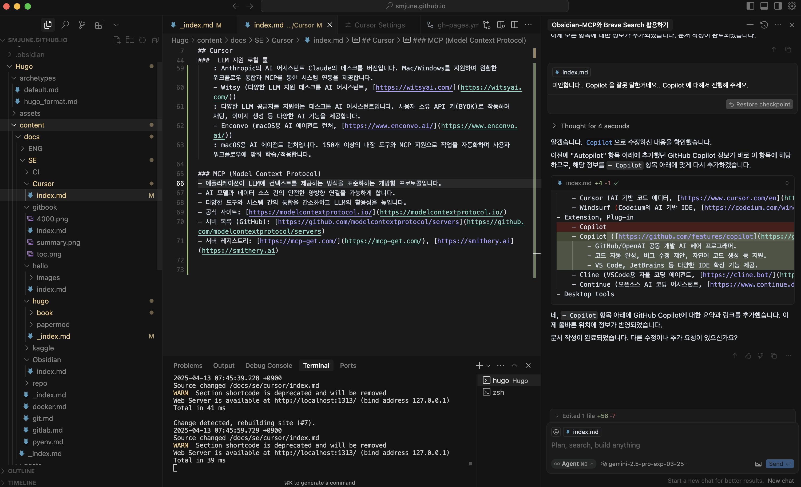
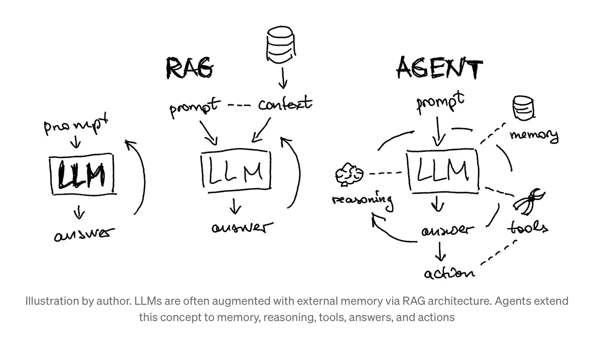
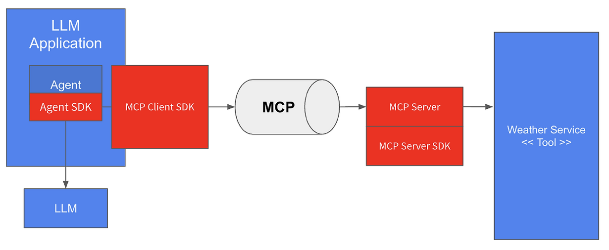

## LLM 환경 구축 개요

이 문서는 다양한 LLM(Large Language Model)을 활용하여 로컬 개발 환경을 구축하는 데 필요한 도구와 기술을 소개합니다. Cloud LLM부터 로컬 실행 도구, 개발 환경 연동 도구까지 폭넓게 다룹니다.

### 1. Cloud LLM (클라우드 기반 모델)

클라우드 서버에서 강력한 성능을 제공하는 상용 LLM입니다. API를 통해 접근하며, 고성능 추론 능력이 필요할 때 유용합니다.

-   **GPT (OpenAI):** [https://platform.openai.com/docs/models](https://platform.openai.com/docs/models)
    -   **주요 특징:** 강력한 자연어 이해 및 생성 능력, 다양한 모델(GPT-4, GPT-4o 등) 제공, 광범위한 API 생태계.
    -   **가격:** 사용량 기반 유료 (API 호출당 과금), ChatGPT는 무료/유료 구독 플랜 제공.
    -   **활용:** 챗봇, 콘텐츠 생성, 코드 생성, 번역 등.
-   **Gemini (Google):** [https://deepmind.google/technologies/gemini/](https://deepmind.google/technologies/gemini/)
    -   **주요 특징:** 멀티모달(텍스트, 이미지, 오디오, 비디오) 처리 능력, 다양한 크기(Ultra, Pro, Flash, Nano) 제공, Google 생태계 연동.
    -   **가격:** 사용량 기반 유료 (Vertex AI API), Google AI Studio 및 Gemini 앱에서 무료/유료 플랜 제공.
    -   **활용:** 멀티모달 콘텐츠 생성, 복잡한 추론, 데이터 분석, Google Workspace 연동.
-   **Claude (Anthropic):** [https://www.anthropic.com/claude](https://www.anthropic.com/claude)
    -   **주요 특징:** 안전성 및 윤리성 강조(Constitutional AI), 긴 컨텍스트 처리 능력, 창의적 글쓰기 및 코딩 능력.
    -   **가격:** 사용량 기반 유료 (API), Claude.ai 웹사이트 및 앱에서 무료/유료 플랜 제공.
    -   **활용:** 긴 문서 요약/분석, 창의적 글쓰기, 안전한 대화형 AI 개발.
-   **Grok (xAI):** [https://x.ai/grok](https://x.ai/grok)
    -   **주요 특징:** 실시간 정보 접근(X 플랫폼 연동), 유머러스하고 반항적인 페르소나, 최신 정보 기반 답변.
    -   **가격:** X Premium+ 구독 필요. API 접근은 별도 제공될 수 있음.
    -   **활용:** 최신 뉴스/트렌드 기반 질의응답, 특정 관점의 정보 탐색.
-   **Perplexity:** [https://www.perplexity.ai/](https://www.perplexity.ai/)
    -   **주요 특징:** AI 기반 검색 엔진과 챗봇 기술 결합, GPT-4/Claude 3 등 최신 모델 활용, 실시간 웹 검색 및 Q&A, 복잡한 추론을 위한 o13 시리즈 모델 제공.
    -   **가격:** 무료 플랜, Pro 구독(일 300회+ Pro 검색), Enterprise 플랜 제공.
    -   **활용:** 실시간 정보 검색/분석, 학술 연구, 코딩 문제 해결, 복잡한 추론 작업.
    -   **차별점:** 실시간 웹 검색 통합으로 최신 정보 제공(다른 LLM들의 학습 데이터 제한 극복), 모든 답변에 대한 출처 링크 제공으로 신뢰성 확보, 검색 엔진과 LLM의 하이브리드 접근으로 정확성 향상.

### 2. Open LLM & Hub (오픈소스 모델과 허브)

- **대표적인 Open Source LLM:**
    -   Llama (Meta)
        > - GPT-4.5, Claude 3.7 Sonnet 수준의 STEM 성능 달성
        > - 128k 토큰의 긴 컨텍스트 윈도우 지원
        > - 8개 언어 지원 및 강화된 안전성 기능 탑재
    -   Mistral / Mixtral (Mistral AI)
        > - Llama 2 70B 대비 6배 빠른 추론 속도와 더 높은 성능
        > - 코드 생성, 수학, 추론 능력에서 뛰어난 성능
        > - 140개 이상 언어 지원 및 고급 함수 호출 기능
    -   Gemma (Google)
        > - Gemini 기술 기반의 경량 오픈소스 모델
        > - 고해상도 비정사각형 이미지 처리 및 향상된 추론 능력
        > - 단일 GPU/TPU에서 실행 가능한 최고 성능 모델
    -   Phi (Microsoft)
        > - 동일 크기 및 상위 크기 모델 대비 우수한 성능
        > - 20만 단어 어휘로 다국어 지원 강화
        > - 그룹 쿼리 어텐션, 내장 함수 호출 기능 제공
    -   Qwen (Alibaba)
        > - GPT-4o, DeepSeek-V3, Llama-3.1-405B 대비 우수한 성능
        > - 텍스트, 이미지, 오디오, 비디오 통합 처리 가능
        > - 32k 토큰 컨텍스트와 강화된 추론 능력

- **HuggingFace:** [https://huggingface.co/](https://huggingface.co/)  

    오픈소스 LLM 모델과 데이터셋을 공유하고 협업하는 플랫폼입니다.

    -   **주요 특징:** 방대한 모델/데이터셋 저장소(Hub), 모델 학습/추론 라이브러리(Transformers, Diffusers 등), 데모 공유(Spaces), LLM 리더보드, 학습 코스 제공.
    -   **가격:** 대부분 무료, 유료 플랜(추가 기능, 우선 지원 등) 제공.
    -   **활용:** 오픈소스 모델 탐색/다운로드, 모델 파인튜닝, AI 애플리케이션 개발/배포.

### 3. Local LLM Launcher (로컬 실행 도구)

로컬 컴퓨터 환경에서 LLM을 쉽게 다운로드하고 실행할 수 있도록 돕는 GUI/CLI 기반 도구입니다.

-   **LM Studio:** [https://lmstudio.ai/](https://lmstudio.ai/)
    -   **주요 특징:** 사용자 친화적인 GUI, 모델 검색/다운로드/관리 용이, 다양한 모델 포맷 지원(GGUF 등), 내장 채팅 인터페이스 및 API 서버 기능.
    -   **지원 모델:** HuggingFace 등에서 제공되는 GGUF 포맷 모델 대부분.
    -   **가격:** 무료.
    -   **설치:** 웹사이트에서 OS별(Mac, Windows, Linux) 설치 파일 다운로드.
-   **Ollama:** [https://ollama.com/](https://ollama.com/)
    -   **주요 특징:** CLI 중심의 간편한 모델 실행/관리, 자체 모델 라이브러리 운영, API 서버 기능 기본 제공, 다양한 커뮤니티 통합 지원.
    -   **지원 모델:** 자체 라이브러리 모델(Llama, Mistral, Gemma 등 다수) 및 GGUF 모델 임포트.
    -   **가격:** 무료.
    -   **설치:** 웹사이트에서 OS별(Mac, Windows, Linux) 설치 파일 다운로드 또는 CLI 명령어(`curl`, `brew` 등).

-   **비교 요약 (Local LLM Launcher):**
    | 특징             | LM Studio                   | Ollama                     |
    | :--------------- | :-------------------------- | :------------------------- |
    | **인터페이스**   | GUI 중심 (채팅 포함)        | CLI 중심 (API 서버 주력)  |
    | **모델 관리**    | GUI 내 검색/다운로드        | CLI 명령어 (`pull`, `run`) |
    | **주요 사용자층**| 초보자, GUI 선호 사용자    | 개발자, CLI 선호 사용자    |
    | **생태계**       | 자체 기능 중심              | 다양한 외부 도구 연동 활발 |

### 4. LLM 지원 로컬 툴 (개발 환경 연동)

로컬 개발 환경(IDE, 텍스트 에디터 등) 내에서 LLM 기능을 활용할 수 있도록 돕는 도구들입니다.

- AI Code Editor : Cursor, Windsuf
- AI Code Extension : Continue, Cline, Copilot, Gemini Code Assist
* AI luncher : Claud Desk top, Witcy, Enconvo
* Obsidian + AI community plug-in (SmartComposer, Copilot, ...)

#### 4.1 AI Code Editor (AI 네이티브 에디터)

LLM 기능이 깊숙이 통합된 코드 에디터입니다.

-   **Cursor:** [https://www.cursor.com/en](https://www.cursor.com/en)   
    -   **주요 특징:** VS Code 기반, AI 기반 코드 생성/편집/리팩토링, "Codebase-aware" 채팅, 로컬 모델 연동 지원(설정 필요).
    -   **지원 모델:** OpenAI 모델(기본), Anthropic 모델, Azure OpenAI, 로컬 모델(Ollama, LM Studio 등 연동).
    -   **가격:** 무료 플랜(제한적 사용), 유료 Pro/Business 플랜.
    -   **설치:** 웹사이트에서 OS별 설치 파일 다운로드.
    - [Cursor 커뮤니티](https://forum.cursor.com),[Cursor MCP, Rule ...](https://cursor.directory)
    - 활용예시 : cursor + git + obsidian 
     

-   **Windsurf:** [https://codeium.com/windsurf](https://codeium.com/windsurf)
    -   **주요 특징:** Codeium 개발, 빠른 자동 완성, Context Engine 기반 이해, 다중 파일 편집 지원, 경량화 추구.
    -   **지원 모델:** Codeium 자체 모델, 로컬 모델 연동 지원 논의 중/개발 중.
    -   **가격:** 현재 무료 (베타 기간 등 정책 변동 가능).
    -   **설치:** 웹사이트에서 OS별 설치 파일 다운로드.

-   **비교 요약 (Code Editor):**
    | 특징             | Cursor                      | Windsurf (Codeium)          |
    | :--------------- | :-------------------------- | :-------------------------- |
    | **기반**         | VS Code Fork                | 자체 개발 (경량화)         |
    | **핵심 기능**    | 코드베이스 이해, 채팅 중심 | 빠른 자동완성, 컨텍스트 엔진 |
    | **로컬 모델**    | 지원 (Ollama, LM Studio 등) | 제한적/개발 중             |
    | **가격**         | 무료/유료 플랜              | 현재 무료                   |

#### 4.2 Extension, Plug-in (IDE 확장 기능)

기존 IDE(VScode)에 설치하여 LLM 기능을 추가하는 확장 프로그램입니다.

-   **Continue:** [https://www.continue.dev/](https://www.continue.dev/)
    -   **주요 특징:** 오픈소스, 다양한 모델(로컬/클라우드) 연결 유연성, 사용자 정의 컨텍스트 제공(파일, 터미널 등), 자동 완성 및 채팅.
    -   **지원 모델:** OpenAI, Anthropic, Google, Mistral, Ollama, LM Studio 등 다수.
    -   **가격:** 무료 (오픈소스).
    -   **설치:** VS Code, JetBrains 마켓플레이스에서 설치.
-   **Cline:** [https://cline.bot/](https://cline.bot/)
    -   **주요 특징:** 오픈소스, 자율 코딩 에이전트 지향, Plan/Act 모드, 터미널 실행, MCP(Model Context Protocol) 지원.
    -   **지원 모델:** OpenAI, Anthropic, Google, Ollama, LM Studio 등 다수.
    -   **가격:** 무료 (오픈소스).
    -   **설치:** VS Code 마켓플레이스에서 설치.
-   **GitHub Copilot:** [https://github.com/features/copilot](https://github.com/features/copilot)
    -   **주요 특징:** GitHub/OpenAI 개발, 강력한 코드 자동 완성 및 제안, 채팅 기능(Copilot Chat), 광범위한 언어/IDE 지원.
    -   **지원 모델:** OpenAI 모델(GPT 기반).
    -   **가격:** 유료 구독 (개인/비즈니스), 학생/오픈소스 기여자 무료.
    -   **설치:** 각 IDE 마켓플레이스에서 설치 (VS Code, JetBrains 등).
-   **Gemini Code Assist:** [https://developers.google.com/gemini-code-assist](https://developers.google.com/gemini-code-assist)
    -   **주요 특징:** Google 개발, 코드 자동 완성, 디버깅 지원, 프로그래밍 개념 학습 지원, GitHub 통합
    -   **지원 모델:** Google Gemini
    -   **가격:** 개인 사용자 무료, 기업용 Standard/Enterprise 버전 유료
    -   **설치:** VS Code, JetBrains IDE, Cloud Shell Editor에서 설치 가능

-   **비교 요약 (Extension, Plug-in):**
    | 특징             | Continue                    | Cline                       | GitHub Copilot              | Gemini Code Assist          |
    | :--------------- | :-------------------------- | :-------------------------- | :-------------------------- | :-------------------------- |
    | **개발 주체**    | 커뮤니티 (오픈소스)         | 커뮤니티 (오픈소스)         | GitHub/OpenAI               | Google                      |
    | **핵심 기능**    | 모델 유연성, 컨텍스트       | 자율 에이전트, MCP          | 코드 완성, 채팅             | 코드 완성, 디버깅, 학습     |
    | **로컬 모델 지원**| 매우 우수 (Ollama 등)       | 매우 우수 (Ollama 등)       | 제한적/미지원               | 미지원                      |
    | **가격**         | 무료                        | 무료                        | 유료 (일부 무료)            | 무료 (기업용 유료)          |

-   **활용 예시:**
    -   `Ollama` 또는 `LM Studio`를 사용하여 로컬에 `Llama 3` 모델을 실행시킨 후, `Continue` 또는 `Cline` 확장 프로그램을 통해 VS Code에서 해당 로컬 모델을 코드 생성 및 분석에 활용할 수 있습니다. 이를 통해 민감한 코드를 외부로 전송하지 않고 AI 지원을 받을 수 있습니다.

#### 4.3 AI launcher (데스크톱 애플리케이션)

독립적으로 실행되는 LLM 관련 데스크톱 애플리케이션입니다.

-   **Claude desktop:** [https://claude.ai/download](https://claude.ai/download)
    -   **주요 특징:** Anthropic의 Claude 모델 공식 데스크톱 앱, 웹 버전 기능 대부분 제공, 파일 업로드 및 분석 용이, MCP 지원.
    -   **지원 모델:** Claude 모델.
    -   **가격:** 웹 버전과 동일 (무료/유료 플랜).
    -   **설치:** 웹사이트에서 OS(Mac, Windows)별 설치 파일 다운로드.
-   **Witsy:** [https://witsyai.com/](https://witsyai.com/)
    -   **주요 특징:** 다양한 LLM API 키 등록(BYOK) 방식, 채팅, 이미지 생성, 프롬프트 라이브러리, 'Prompt Anywhere' 기능.
    -   **지원 모델:** OpenAI, Anthropic, Google, Mistral, Ollama 등 다수 API/로컬 모델 연동.
    -   **가격:** 무료/유료 플랜.
    -   **설치:** 웹사이트에서 OS(Mac, Windows, Linux)별 설치 파일 다운로드.
-   **Enconvo:** [https://www.enconvo.ai/](https://www.enconvo.ai/)
    -   **주요 특징:** macOS용 AI 에이전트 런처, 150개 이상 내장 도구, 워크플로우 자동화, MCP 지원.
    -   **지원 모델:** OpenAI, Anthropic 등 Cloud LLM 및 로컬 모델 연동.
    -   **가격:** 유료 구독.
    -   **설치:** 웹사이트에서 macOS 설치 파일 다운로드.

-   **비교 요약 (Desktop tools):**
    | 특징             | Claude desktop              | Witsy                       | Enconvo                     |
    | :--------------- | :-------------------------- | :-------------------------- | :-------------------------- |
    | **주요 기능**    | Claude 모델 접근            | 다중 LLM 통합, 유틸리티     | 워크플로우 자동화 (macOS) |
    | **개발 주체**    | Anthropic                   | 개인/팀 개발                | 개인/팀 개발                |
    | **플랫폼**       | Mac, Windows                | Mac, Windows, Linux         | macOS                       |
    | **가격**         | 무료/유료 플랜              | 무료/유료 플랜              | 유료 구독                   |

### 5. MCP (Model Context Protocol)

애플리케이션과 AI 모델 간의 컨텍스트 정보 교환을 표준화하는 개방형 프로토콜입니다.

-   **주요 특징:** LLM이 외부 도구/데이터 소스와 안전하고 표준화된 방식으로 상호작용하도록 지원, 개발 생산성 향상, 도구 간 상호 운용성 증대.
-   **활용:** AI 에이전트 개발, 외부 API 연동, 코드베이스/데이터베이스 접근 등.
-   **관련 도구:** Cline, Claude desktop, Enconvo 등 MCP를 지원하는 클라이언트/서버 구현체 다수 존재.
-   **공식 사이트:** [https://modelcontextprotocol.io/](https://modelcontextprotocol.io/)
-   **서버 목록 (GitHub):** [https://github.com/modelcontextprotocol/servers](https://github.com/modelcontextprotocol/servers)
-   **서버 레지스트리:** [https://mcp-get.com/](https://mcp-get.com/), [https://smithery.ai](https://smithery.ai)

MCP 이해하려면 Agent 을 먼저 이해해야 한다. 
####  Agent

1. An AI agent is a system that uses an LLM to decide the control flow of an application. [내용출처](https://blog.langchain.dev/what-is-an-agent/)

2. **Agent = LLM + planning + Memory + Tool use** : In a LLM-powered autonomous agent system, LLM functions as the agent’s brain, complemented by several key components:   [내용 출처](https://lilianweng.github.io/posts/2023-06-23-agent/)

	- **Planning**
	    - Subgoal and decomposition: The agent breaks down large tasks into smaller, manageable subgoals, enabling efficient handling of complex tasks.
	    - Reflection and refinement: The agent can do self-criticism and self-reflection over past actions, learn from mistakes and refine them for future steps, thereby improving the quality of final results.
	- **Memory**
	    - Short-term memory: I would consider all the in-context learning (See [Prompt Engineering](https://lilianweng.github.io/posts/2023-03-15-prompt-engineering/)) as utilizing short-term memory of the model to learn.
	    - Long-term memory: This provides the agent with the capability to retain and recall (infinite) information over extended periods, often by leveraging an external vector store and fast retrieval.
	- **Tool use**
	    - The agent learns to call external APIs for extra information that is missing from the model weights (often hard to change after pre-training), including current information, code execution capability, access to proprietary information sources and more.

3. Agent Framework  : There are many frameworks that make agentic systems easier to implement, including: [내용 출처](https://www.anthropic.com/engineering/building-effective-agents)

- [LangGraph](https://langchain-ai.github.io/langgraph/) from LangChain;
- Amazon Bedrock's [AI Agent framework](https://aws.amazon.com/bedrock/agents/);
- [Rivet](https://rivet.ironcladapp.com/), a drag and drop GUI LLM workflow builder; and
- [Vellum](https://www.vellum.ai/), another GUI tool for building and testing complex workflows.  

- Agent Framework : LLM 이 외부 서비스와 협업을 하면서, 질문에 대한 답을 찾아가게 하는 app, agent 을 구축하기 위히 외부 서비스와 LLM 을 어떻게 조합(?) 할 것인가?

[이미지출처](https://bcho.tistory.com/1470)

4. RAG vs Workflow(Chain) vs Agent : 차이점

[이미지 출처](https://medium.com/data-science/intro-to-llm-agents-with-langchain-when-rag-is-not-enough-7d8c08145834)

  [이미지 출처](https://python.langchain.com/v0.1/docs/use_cases/tool_use/)

5. MCP SDK
The [Model Context Protocol (MCP)](https://modelcontextprotocol.io/) lets you build servers that expose data and functionality to LLM applications in a secure, standardized way. Think of it like a web API, but specifically designed for LLM interactions. MCP servers can:

- Expose data through **Resources** (think of these sort of like GET endpoints; they are used to load information into the LLM's context)
- Provide functionality through **Tools** (sort of like POST endpoints; they are used to execute code or otherwise produce a side effect)
- Define interaction patterns through **Prompts** (reusable templates for LLM interactions)
- And more!

- Python : https://github.com/modelcontextprotocol/python-sdk

###  참고자료
[Google Agent WhitePaper](https://www.kaggle.com/whitepaper-agents?trk=public_post_comment-text)
[LLM Powered Autonomous Agents](https://lilianweng.github.io/posts/2023-06-23-agent/)

---

이 문서는 계속 업데이트될 수 있습니다.

