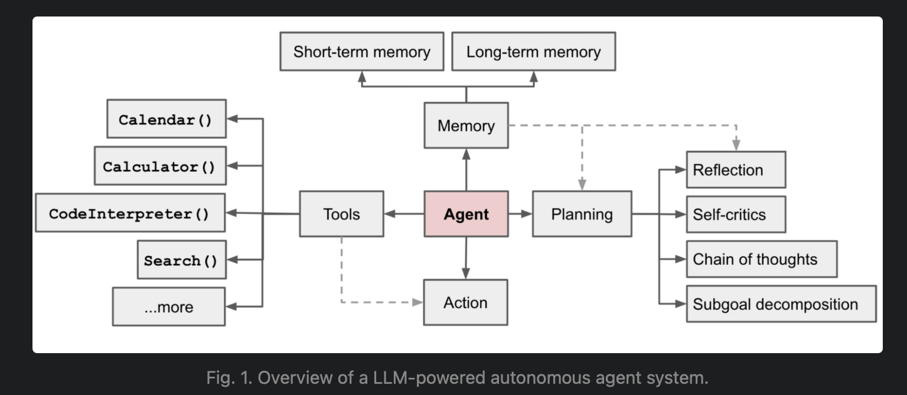
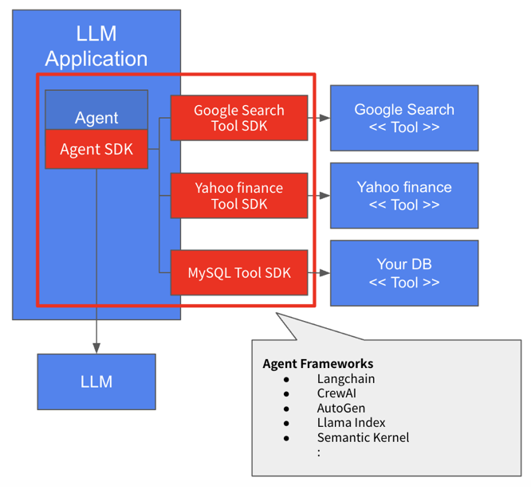
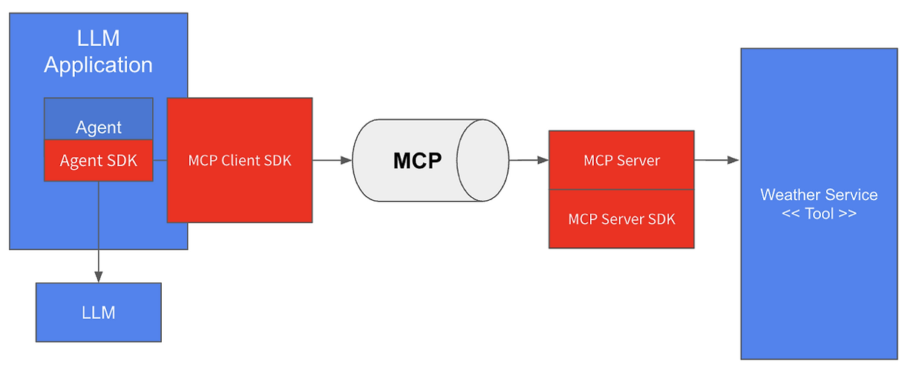
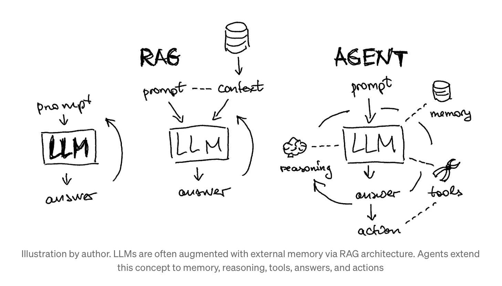
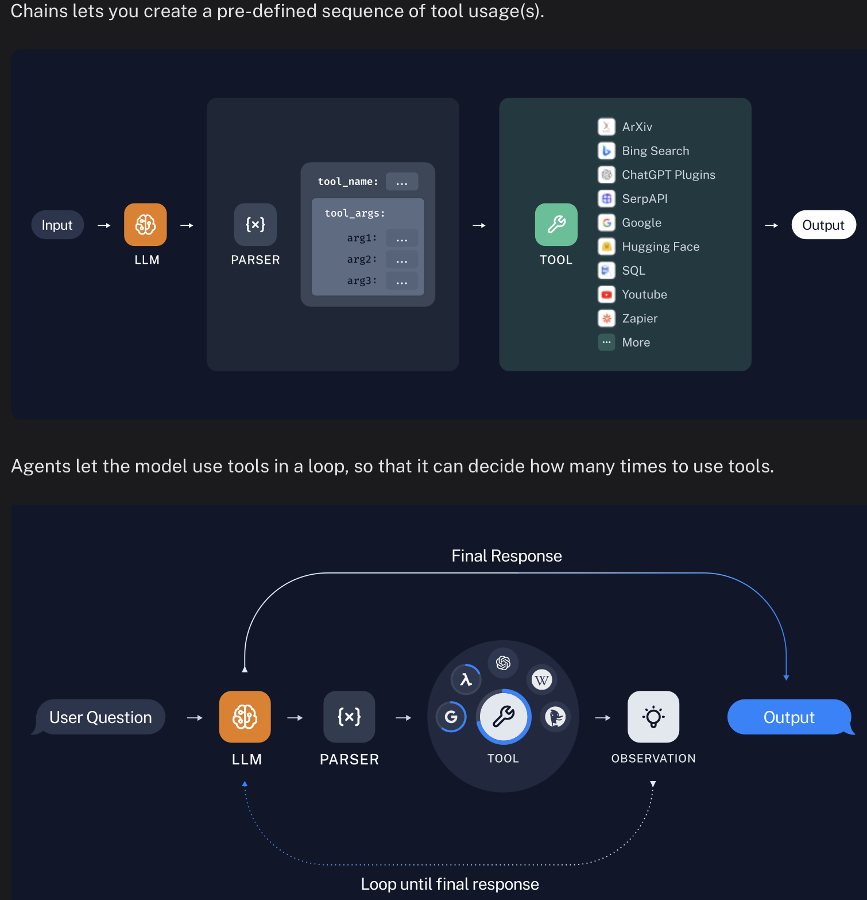

##  Agent

1. An AI agent is a system that uses an LLM to decide the control flow of an application. [내용출처](https://blog.langchain.dev/what-is-an-agent/)

2. **Agent = LLM + planning + Memory + Tool use** : In a LLM-powered autonomous agent system, LLM functions as the agent’s brain, complemented by several key components:   [내용 출처](https://lilianweng.github.io/posts/2023-06-23-agent/)

	- **Planning**
	    - Subgoal and decomposition: The agent breaks down large tasks into smaller, manageable subgoals, enabling efficient handling of complex tasks.
	    - Reflection and refinement: The agent can do self-criticism and self-reflection over past actions, learn from mistakes and refine them for future steps, thereby improving the quality of final results.
	- **Memory**
	    - Short-term memory: I would consider all the in-context learning (See [Prompt Engineering](https://lilianweng.github.io/posts/2023-03-15-prompt-engineering/)) as utilizing short-term memory of the model to learn.
	    - Long-term memory: This provides the agent with the capability to retain and recall (infinite) information over extended periods, often by leveraging an external vector store and fast retrieval.
	- **Tool use**
	    - The agent learns to call external APIs for extra information that is missing from the model weights (often hard to change after pre-training), including current information, code execution capability, access to proprietary information sources and more.

3.  Agent Type

|Feature|LLM Agent (`LlmAgent`)|Workflow Agent|Custom Agent (`BaseAgent` subclass)|
|---|---|---|---|
|**Primary Function**|Reasoning, Generation, Tool Use|Controlling Agent Execution Flow|Implementing Unique Logic/Integrations|
|**Core Engine**|Large Language Model (LLM)|Predefined Logic (Sequence, Parallel, Loop)|Custom Python Code|
|**Determinism**|Non-deterministic (Flexible)|Deterministic (Predictable)|Can be either, based on implementation|
|**Primary Use**|Language tasks, Dynamic decisions|Structured processes, Orchestration|Tailored requirements, Specific workflows|
- Multi-Agent
While each agent type serves a distinct purpose, the true power often comes from combining them. You can compose various types of agents derived from `BaseAgent` to build **Multi-agent system**
### Agent Framework  
:  LLM 이 외부 서비스와 협업을 하면서, 질문에 대한 답을 찾아가게 하는 app, 
: agent 을 구축하기 위해 외부 서비스와 LLM 을 어떻게 조합(?) 할 것인가?

: There are many frameworks that make agentic systems easier to implement, including: [내용 출처](https://www.anthropic.com/engineering/building-effective-agents)

- [LangGraph](https://langchain-ai.github.io/langgraph/) from LangChain
- [Google ADK](https://google.github.io/adk-docs/)
	- [agent samples form ADK](https://github.com/google/adk-samples)
- [Langflow](https://docs.langflow.org/)is a new, visual framework for building multi-agent and RAG applications. It is open-source, Python-powered, fully customizable, and LLM and vector store agnostic.
-  [Microsoft Semantic Kernel](https://learn.microsoft.com/en-us/semantic-kernel/overview/) is a lightweight, open-source development kit that lets you easily build AI agents and integrate the latest AI models into your C#, Python, or Java codebase.
-  [LlamaIndex](https://docs.llamaindex.ai/en/stable/understanding/agent/) is a simple, flexible framework for building agentic generative AI applications that allow large language models to work with your data in any format.
- [CrewAI](https://github.com/crewAIInc/crewAI) is a lean, lightning-fast Python framework built entirely from scratch—completely **independent of LangChain or other agent frameworks**.
- [AG2](https://docs.ag2.ai/latest/docs/quick-start/), (formerly AutoGen) is an open-source programming framework for building AI agents
- Amazon Bedrock's [AI Agent framework](https://aws.amazon.com/bedrock/agents/);
- [Rivet](https://rivet.ironcladapp.com/), a drag and drop GUI LLM workflow builder
- [Vellum](https://www.vellum.ai/), another GUI tool for building and testing complex workflows.  
- [Marvin](https://askmarvin.ai/welcome) is a Python framework for building AI applications with LLMs.

###  Sample Agents
: All the agents in [this directory](https://github.com/google/A2A/blob/main/samples/python/agents/README.md) are samples built on different frameworks highlighting different capabilities. Each agent runs as a standalone A2A server.

### Build an AI agent from scratch in python 
: https://youtu.be/bTMPwUgLZf0?si=TZ44h-oOoxAORjoR 

### Integrating REST APIs with OpenAPI
: ADK simplifies interacting with external REST APIs by automatically generating callable tools directly from an [OpenAPI Specification (v3.x)](https://swagger.io/specification/). This eliminates the need to manually define individual function tools for each API endpoint.

[이미지출처](https://bcho.tistory.com/1470)

## MCP 
The [Model Context Protocol (MCP)](https://modelcontextprotocol.io/) lets you build servers that expose data and functionality to LLM applications in a secure, standardized way. Think of it like a web API, but specifically designed for LLM interactions. MCP servers can:

- Expose data through **Resources** (think of these sort of like GET endpoints; they are used to load information into the LLM's context)
- Provide functionality through **Tools** (sort of like POST endpoints; they are used to execute code or otherwise produce a side effect)
- Define interaction patterns through **Prompts** (reusable templates for LLM interactions)
- And more!

- Python : https://github.com/modelcontextprotocol/python-sdk

## A2A
https://github.com/google/A2A/

### RAG, Workflow(Chain) vs Agent 

[이미지 출처](https://medium.com/data-science/intro-to-llm-agents-with-langchain-when-rag-is-not-enough-7d8c08145834)

  [이미지 출처](https://python.langchain.com/v0.1/docs/use_cases/tool_use/)

###  참고자료
[Google Agent WhitePaper](https://www.kaggle.com/whitepaper-agents?trk=public_post_comment-text)    
[LLM Powered Autonomous Agents](https://lilianweng.github.io/posts/2023-06-23-agent/)

