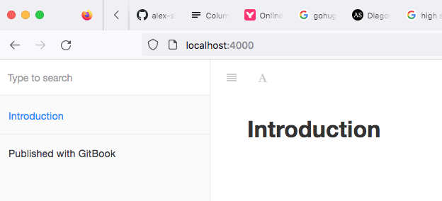

## Gitbook

Hugo 처럼 로컬에서 빌드하여 별도 web hosting (github pages) 으로 publish 하는 방식으로 사용해도 되고,  
gitbook.com 에 접속하여 GUI을 이용하여 운영 할 수도 있다.  
(Web hosting 제공 : https://YOUR_ACCOUNT.gitbook.io/, 무료/유로)  

아래 내용은 gitbook-cli을 이용하여 Static site을 생성한 다음 별도 Web hosting 을 이용하는 방식을 기록함  
[참고](https://www.onejar99.com/how-to-build-and-publish-your-own-gitbook-free-unlimitedly-and-automatically-using-github-pages-and-github-actions/)  


2017년 이후로 gitbook-cli 가 업데이트을 지원하지 않음  
Google, MS 등 SW 개발 도규먼트들과 비슷한 형태로  
(gitbook 으로 작성된것이라고 들은것 같은데... 확실치 않음.)  
그래도 그나마 눈에 익숙하고, 여러형태의 e-book 으로도 지원했던것 같다. (calibre 설치, [참조](https://blog.appkr.dev/work-n-play/pandoc-gitbook-%EC%A0%84%EC%9E%90%EC%B6%9C%ED%8C%90/))  
설치 난이도 [참조](https://github.com/GitbookIO/gitbook-cli/issues/110) 와 github actions 지원이 좀 애매하다. [참조](https://github.com/SoftUni/Programming-Basics-Book-JS-EN/blob/master/.github/workflows/gitbook-deploy.yml)

* Known Dependencies  
node : v12.22.1  
npm : v6.14.12  
gitbook-cli : gitbook-cli@2.3.2  
graceful-fs : 4.1.4  

**관련사이트**  
https://github.com/GitbookIO/gitbook-cli  
https://docs.gitbook.com/integrations/github  
https://www.gitbook.com/  


## install gitbook  
on MacOS (high sierra, 10.13.6)

```bash
# Mac OSX.
$ brew install node
 
# 해당 명령어로 오류가 나서 nvm 을 설치 하여 node 12.22.1 을 설치 
# brew install nvm  이후, 가이드에 따라 설정 
$ nvm -v
0.39.3
# gitbook dependencies 해결 node 버전 설치 
$ nvm install 12.22.1
Downloading and installing node v12.22.1...
Downloading https://nodejs.org/dist/v12.22.1/node-v12.22.1-darwin-x64.tar.xz...
######################################################################## 100.0%
Computing checksum with shasum -a 256
Checksums matched!
Now using node v12.22.1 (npm v6.14.12)
Creating default alias: default -> 12.22.1 (-> v12.22.1)
$ nvm use 12.22.1
Now using node v12.22.1 (npm v6.14.12)
$ node -v
v12.22.1
# https://github.com/GitbookIO/gitbook-cli/issues/110 참조해서 graceful-fs dependecies 해결 후 
$ gitbook init
...
$ gitbook serve
Live reload server started on port: 35729
Press CTRL+C to quit ...

info: 7 plugins are installed 
info: loading plugin "livereload"... OK 
info: loading plugin "highlight"... OK 
info: loading plugin "search"... OK 
info: loading plugin "lunr"... OK 
info: loading plugin "sharing"... OK 
info: loading plugin "fontsettings"... OK 
info: loading plugin "theme-default"... OK 
info: found 1 pages 
info: found 0 asset files 
info: >> generation finished with success in 0.7s ! 

Starting server ...
Serving book on http://localhost:4000

# Ubuntu 도 아래 명령어로 오류가 나면, nvm 을 설치해서 사용해야 할듯.
# $ sudo apt-get install nodejs npm
```

위의 결과로 아래와 같은 형태가 구성됨  
```
$ gitbook -V
CLI version: 2.3.2
GitBook version: 3.2.3
$ ls
README.md	SUMMARY.md	_book
```
```
.                 # gitbook prj root 
├── README.md     # Introduction readme
├── SUMMARY.md    # 목차 구성 파일
└── _book/	      # gitbook serve 로 생성된 결과 파일 
```
### docs 폴더로 운영 
SW 개발 프로젝트 하위 /docs 폴더로 gitbook 운영이 필요할때
```
.
├── book.json
└── docs/
    ├── README.md
    └── SUMMARY.md
```
```
{
    "root": "./docs"
}
```

* localhost:4000 에서 결과 보기 




gitbook-cli 는 2007년 이후 더이상 지원 되지 않고 있어, 향후 어떻게 gitbook.com 과 차별을 두고 다시 지원을 하게 될찌 궁금하다. 예전고 같은 형태가 될찌, gitbook.com 전용 client tool 이 될찌. 2007년 기준 gitbook-cli (v2.3.2)을 사용하게 된다면 nvm 을 이용해서 최신 node 와 구분하여 사용할 수 밖에 없다. pyenv 처럼 


## Config 구성 
README.md, SUMMARY.md, book.json (플러그인 설정) 등 기본적인 형태를 갖추게할 기본 파일들 구성 및 content 용 md 파일 구성
(Hugo의 index.md 처럼 README.md 을 이용하는 것으로 보임.)  
[상세 내용 참고](https://tinydew4.gitbooks.io/gitbook/content/ko/)

### SUMMARY

1. 폴더에 readme 가 없으면 indent 가 더 들어간다. 
2. 

### book.json 

1. plugin 설치  

예) 오른쪽 ToC 접기와, 왼쪽에 page 목차 앵커 표시  
book.json 에 plugin 설정하고, "$gitbook install" 으로 설치.

```json
{
    "plugins": ["expand-active-chapter","navigator"]
}
```

결과 

```bash
$ gitbook install
info: installing 2 plugins using npm@3.9.2 
info:  
info: installing plugin "expand-active-chapter" 
info: install plugin "expand-active-chapter" (*) from NPM with version 1.0.0 
/Users/myoungjunesung/blog/gitbook
└── gitbook-plugin-expand-active-chapter@1.0.0 

info: >> plugin "expand-active-chapter" installed with success 
info:  
info: installing plugin "navigator" 
runTopLevelLifecycles → 2 ▐ ╢█████████████████████████████████████████████████████████████████████████████████░░░╟
/Users/myoungjunesung/blog/gitbook
├── gitbook-plugin-expand-active-chapter@1.0.0 
└─┬ gitbook-plugin-navigator@1.1.1 
...
info: >> plugin "navigator" installed with success
$
```

--- 