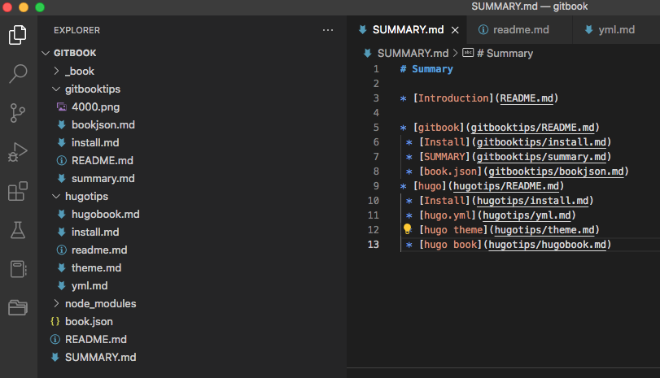
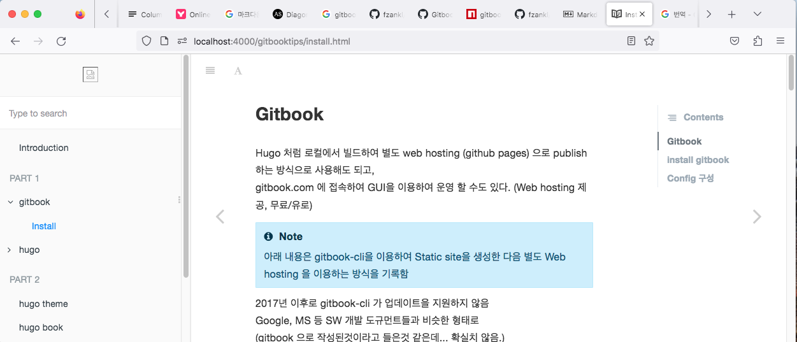

## Gitbook

Hugo 처럼 로컬에서 빌드하여 별도 web hosting (github pages) 으로 publish 하는 방식으로 사용해도 되고,  
gitbook.com 에 접속하여 GUI을 이용하여 운영 할 수도 있다.  
(Web hosting 제공 : https://YOUR_ACCOUNT.gitbook.io/, 무료/유로)  

아래 내용은 gitbook-cli을 이용하여 Static site을 생성한 다음 별도 Web hosting 을 이용하는 방식을 기록함  
[참고](https://www.onejar99.com/how-to-build-and-publish-your-own-gitbook-free-unlimitedly-and-automatically-using-github-pages-and-github-actions/)  


:point_right: **정보**  
2017년 이후로 gitbook-cli 가 업데이트을 지원하지 않음  
Google, MS 등 SW 개발 도규먼트들과 비슷한 형태로  
(gitbook 으로 작성된것이라고 들은것 같은데... 확실치 않음.)  
그래도 그나마 눈에 익숙하고, 여러형태의 e-book 으로도 지원했던것 같다. (calibre 설치, [참조](https://blog.appkr.dev/work-n-play/pandoc-gitbook-%EC%A0%84%EC%9E%90%EC%B6%9C%ED%8C%90/))  
설치 난이도 [참조](https://github.com/GitbookIO/gitbook-cli/issues/110) 와 github actions 지원이 좀 애매하다. [참조](https://github.com/SoftUni/Programming-Basics-Book-JS-EN/blob/master/.github/workflows/gitbook-deploy.yml)

* Known Dependencies  
node : v12.22.1       # works well in v16  
npm : v6.14.12  
gitbook-cli : gitbook-cli@2.3.2  
graceful-fs : 4.1.4  

**관련사이트**  
https://github.com/GitbookIO/gitbook-cli  
https://docs.gitbook.com/integrations/github  
https://www.gitbook.com/  


## install gitbook  
Homebrew on MacOS (high sierra, 10.13.6)
```zsh
# 사전 Homebrew 설치 필요 / $brew update 을 해서 업데이트 하자
...
$ brew -v
Homebrew 4.0.4
Homebrew/homebrew-core (git revision 25e07818a96; last commit 2023-02-28)
$ brew install node

# 해당 명령어로 오류가 나서 nvm 을 설치 하여 node 12.22.1 을 설치 
...
```

### nvm & Node 설치
```zsh
$ brew install nvm  # 이후, 가이드에 따라 bash 환경 설정 
...
$ nvm -v
0.39.3

# nvm 으로 gitbook dependencies 해결 node 버전 설치 
$ nvm install 12.22.1
Downloading and installing node v12.22.1...
Downloading https://nodejs.org/dist/v12.22.1/node-v12.22.1-darwin-x64.tar.xz...
######################################################################## 100.0%
Computing checksum with shasum -a 256
Checksums matched!
Now using node v12.22.1 (npm v6.14.12)
Creating default alias: default -> 12.22.1 (-> v12.22.1)
# 12.22.1 한개 설치되어서 설정하지 않아도 될듯한데, 혹시 모르니...
$ nvm use 12.22.1                      
Now using node v12.22.1 (npm v6.14.12)
$ node -v
v12.22.1
```
### gitbook-cli 설치
```zsh
$ npm i -g gitbook-cli 
$ gitbook init
...
```
### graceful-fs 오류 처리 :warning:  
[gitbook QnA](https://github.com/GitbookIO/gitbook-cli/issues/110) 을 참조해서 graceful-fs dependecies 을 해결하기 위해  
오류를 발생시킨 polyfills.js 찾아서 삭제후, 재설치하는 방식사용
>1. /Users/YOURACCOUNT/.nvm/versions/node/v12.22.1/lib/node_modules/gitbook-cli/node_modules/npm/node_modules/graceful-fs/ 에서 polyfills.js 삭제  
>2. $ wget https://raw.githubusercontent.com/isaacs/node-graceful-fs/168bdb8f0bb3174e8499d4bc5878deead4172c39/polyfills.js 실행 해서 해당 파일 재 설치


위의 결과로 아래와 같은 형태가 구성됨  
```bash
$ gitbook -V
CLI version: 2.3.2
GitBook version: 3.2.3
$ ls
README.md	SUMMARY.md	_book
```
```
.                 # gitbook prj root 
├── README.md     # Introduction readme
├── SUMMARY.md    # 목차 구성 파일
└── _book/        # gitbook serve 로 생성된 결과 파일 
```

**구성된 내용을 브라우저로 미리 볼 수 있다.** 
- $ gitbook **serve**  # 서버가 아니다, 서브

```bash
$ gitbook serve
Live reload server started on port: 35729
Press CTRL+C to quit ...

info: 7 plugins are installed 
info: loading plugin "livereload"... OK 
info: loading plugin "highlight"... OK 
info: loading plugin "search"... OK 
info: loading plugin "lunr"... OK 
info: loading plugin "sharing"... OK 
info: loading plugin "fontsettings"... OK 
info: loading plugin "theme-default"... OK 
info: found 1 pages 
info: found 0 asset files 
info: >> generation finished with success in 0.7s ! 

Starting server ...
Serving book on http://localhost:4000

# Ubuntu 도 아래 명령어로 오류가 나면, nvm 을 설치해서 사용해야 할듯.
# $ sudo apt-get install nodejs npm
```
* localhost:4000 에서 결과 보기 


### docs 폴더로 운영 
SW 개발 프로젝트 하위 /docs 폴더로 gitbook 운영이 필요할때
```
.                        # project root
├── book.json
└── docs/                # gitbook root
    ├── README.md
    └── SUMMARY.md
```
book.json 에 아래 내용 추가,
```
{
    "root": "./docs"
}
```


gitbook-cli 는 2017년 4월 이후 더이상 지원 되지 않고 있어, 향후 어떻게 gitbook.com 과 차별을 두고 다시 지원을 하게 될찌 궁금하다. 예전고 같은 형태가 될찌, gitbook.com 전용 client tool 이 될찌. 2017년 기준 gitbook-cli (v2.3.2)을 사용하게 된다면 nvm 을 이용해서 최신 node 와 구분하여 사용할 수 밖에 없다. pyenv 처럼 


## Book 구성 
- README.md, SUMMARY.md, book.json (플러그인 설정) 등 기본적인 형태를 갖추게할 기본 파일들 구성   
- content 용 md 파일 구성 (Hugo의 index.md 처럼 README.md 을 이용하는 것으로 보임.)  
- [상세 내용 참고](https://tinydew4.gitbooks.io/gitbook/content/ko/)  

### SUMMARY.md

1. 폴더에 readme 가 없으면 indent 가 더 들어간다.  
2. 혹시나 'gitbook' 이라는 폴더를 생성하지 말자. (_book 에서 사용함)  
3. 폴더명에 '공백'이 없도록 주의 하자.  
4. md 파일 링크 없이 목차를 구분하려면 '##' 사용 (예: '## Chapter 1')   

* 목차 구성  



### book.json 
전체적인 환경을 구성할 수 있도록 설정하는 파일으로 보임.

1. plugin 설치  


**[plugin 찾아서 설정하기](https://www.npmjs.com/search?q=gitbook-plugin&page=1&perPage=20)**

book.json 에 plugin 설정하고, "$gitbook install" 으로 설치.
 
```json
{
    "plugins": [
        "code",
        "hints",
        "splitter",
        "-sharing",
        "chapter-fold",
        "back-to-top-button",
        "intopic-toc",
        "insert-logo"
    ],
    "pluginsConfig": {
        "intopic-toc": {
            "label": "Contents"
        },
        "insert-logo": {
            "url": "Path/to/my-logo.png",
            "style": "background: none;"
        }
    }
}
```
* 설치 예
```bash
$ gitbook install

...
info:  
runTopLevelLifecycles → 2 ▌ ╢█████████████████████████████████████████████████████████████████████████████████░░░╟
/Users/myoungjunesung/blog/gitbook
├── gitbook-plugin-back-to-top-button@0.1.4 
├── gitbook-plugin-chapter-fold@0.0.4 
├── gitbook-plugin-code@0.1.0 
├── gitbook-plugin-expand-active-chapter@1.0.0 
├── gitbook-plugin-flexible-alerts@1.0.4 
├── gitbook-plugin-insert-logo@0.1.5 
├── gitbook-plugin-intopic-toc@1.1.1 
├── gitbook-plugin-navigator@1.1.1 
├── gitbook-plugin-search@2.2.1 
└── gitbook-plugin-splitter@0.0.8 
$
```
* Site view  



* **오른쪽 Toc**
[gitbook-plugin-intopic](https://www.npmjs.com/package/gitbook-plugin-intopic-toc/)  

* **왼쪽 메뉴접기**
[gitbook-plugin-chapter-fold](https://www.npmjs.com/package/gitbook-plugin-chapter-fold)  

* **Top으로 가기 버튼**
[gitbook-plugin-back-to-top-button](https://www.npmjs.com/package/gitbook-plugin-back-to-top-button)

* **강조 블럭**
[gitbook-plugin-flexible-alerts](https://www.npmjs.com/package/gitbook-plugin-flexible-alerts)  
    >Note, Tip, Warning, danger 4가지 callout(default) | flate 형태 지원  
    >사용법 : [!Note|style:flate]  

--- 