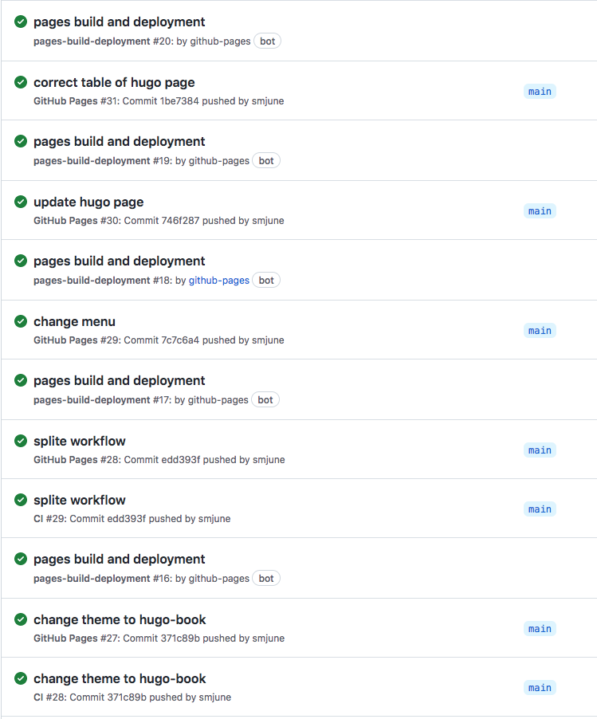

## github 에서 블로그 만들기 

hugo 로컬 빌드를 해서 public 을 submodule 으로 다른 repo 에 push 하는 방식 대신,  
**github action 을 이용하여 1개 repo에서 main 을 빌드 후 gh-pages 브랜치로 deploy 하는 방식 사용**  


**아래 관련 지식 보유 가정**  
   1. 기본 적인 SSG (Static Site Generator)   
   2. Brew, Git, GitHub, VSCode, Hugo 설치 및 사용 방법 (Mac)  
   3. Markdown, YAML, Mermaid 등  

- Editor : Scrivener, VSCode ([Markdown](https://www.markdownguide.org/))
- SSG : HUGO (theme : hugo-book)  
- REPO : github (github.com/smjune/smjune.github.io),  
         gitlab (backup : gitlab.com/smjune/smjune.gitlab.io)
- WEB hosting : smjune.github.io  (GitHub Pages)
   - Project Settings | Pages | Build and Deploy | branches : gh-pages 설정    
- 로컬에서는 'hugo server' 을 이용하여 확인 후 push 함  
- Build & Deploy : github actions / gitlab CI/CD 


## github pages 만들기 
https://docs.github.com/en/pages/  

### github pages 종류
~~~
 1. 개인/ORG github Pages
 2. 프로젝트 github Pages
~~~


flowchart LR;
      A[Create a blog with git]-->B{is it a Personal or ORG?};      
      classDef white color:#022e1f,fill:#fff;
      classDef black color:#fff,fill:#000;
      
      B--YES-->C["Personal or ORG\n https://ACCOUNT.gitxxx.io/"]:::white;
      C--blog only-->E["Personal & Hugo Project\n : git과 hugo가 동일 root"]; 
      C--project & blog-->F["Personal & git project\n : git하위 sorce, hugo 폴더 존재"];
      
      B--NO-->D["Code Project\n https://ACCOUNT.gitxxx.io/PROJECT"]:::black;
      D--project = hugo-->G["Code Project & Hug Project\n git과 hugo가 동일 root"]; 
      D--project & hugo-->H["Code Project & Hug Project\n git하위 source, hugo 폴더 존재"];
  


---

### 1. 개인 Page (Blog) : UserAccont.github.io

* Base URL : https://UserAccount.github.io/
* Repo 주소 : https://github.com/UserAccount/UserAccount.github.io.git
    * 해당 repo 는 pages 을 위한 repo 이므로 hugo project = git project 으로 생성한다. 

    ```bash
    $ hugo new site hugo_project
    $ cd hugo_project
    $ git init
    $ git submodule add https://github.com/theNewDynamic/gohugo-theme-ananke themes/ananke
    $ echo "theme = 'ananke'" >> config.toml
       // edit BaseURL and title
    $ hugo new posts/sample.md
       // edit sample.md
    $ hugo server
       // Be sure it works. if not, correct it
    $ git remote add origin https://github.com/UserAccount/UserAccount.github.io.git
    $ git add .
    $ git commit -m 'initiate project'
    $ git push origin main
    // browse https://UserAccount.github.io/  
    ```


* 폴더 구조  

> hugo project 을 git (github) 로 관리한다고 생각하면 된다.  
> project root 에서 hugo 와 git 명령어를 사용할 수 있다.  
```text
project folder (git, hugo)
 ├─.git
 ├─.gitmodules
 ├─.github
 │  └─workflows
 │     └─gh-pages.yml
 ├─congif.toml
 ├─themes
 │  └─themes folder (submodule)
 ├─content
 │  ├─posts
 │  │  ├─main.md
 │  │  └─...
 │  └─...
 ├─...
 └─readme.md

```  
*Created from https://arthursonzogni.com/Diagon/#Tree*  

---  

### 2. 프로젝트 Page (Blog) UserAccont.github.io/Project

* Base URL : https://UserAccount.github.io/Project
* Repo 주소 : https://github.com/UserAcount/Project.git
    * 해당 repo 는 git 프로젝트 안에 source code 와 hugo 을 포함한다.  

    ```bash
    // 기존 git project 에서 
    $ hugo new site hugo_project
    $ cd hugo_project
    $ git submodule add https://github.com/theNewDynamic/gohugo-theme-ananke themes/ananke
    $ echo "theme = 'ananke'" >> config.toml
       // edit BaseURL and title
    $ hugo new posts/sample.md
       // edit sample.md
    $ hugo server
       // Be sure it works. if not, correct it
    $ cd ..
    $ git add .
    $ git commit -m 'initiate project'
    $ git push origin main
    // browse https://UserAccount.github.io/Project
    ```  

* 폴더 구조

>  프로젝트의 main branch 기본구조는 아래와 같이 구성된다.  
>  프로젝트는 source code folder와 hugo 폴더를 갖는다.  
>  따라서 git 명령어는 project root 에서, hugo 명령어는 hugo 폴더로 이동후 사용한다.  
>  pages 을 deploy 하는 github action 은 .github/workflows/gh-pages.yml 이다.  
>  hugo folder 는 ' $ hugo new site hugo ' 로 생성한다.  
>  theme 는 ' $ git submodule add [submoduel.git] themes/[theme name] '  
>  각 page 는 ' $ hugo new xxx/xxx.md ' 로 생성한다.  
>  프로젝트 gh-pages 브랜치는 hugo 가 빌드된 Web Site (html) 만 존재한다.


```text
project folder (git)
 ├─.git
 ├─.gitmodules
 ├─.github
 │  └─workflows
 │     └─gh-pages.yml
 ├─Source Code folder
 │  ├─lib
 │  │  ├─utillib.lib
 │  │  └─...
 │  ├─build
 │  │  ├─.buildscript
 │  │  └─...
 │  ├─main.cpp
 │  └─...
 ├─hugo project folder (hugo)
 │  ├─congif.toml
 │  ├─themes
 │  │  └─themes folder (submodule)
 │  ├─content
 │  │  ├─posts
 │  │  │  ├─main.md
 │  │  │  └─...
 │  │  └─...
 │  └─...
 ├─...
 └─readme.md

```  
*Created from https://arthursonzogni.com/Diagon/#Tree*  


:bulb: **Idea**   
 _branch 으로 구분하는 방법도 생각해 보았으나, (main, hugo, gh-pages)_  
    _- main branch : soure code 파일 만 존재_  
    _- hugo branch : hugo project 파일만 존재_  
    _- gh-pasges branch : hugo build 결과 (html) 파일만 존재_  
    _동일한 수정에 대한 commit 을 main 브랜치 (source code 수정) 와_  
_hugo 브랜치 (page 수정 ) 에 각각 1번씩 총 2번을 수행해야 하므로 보류_  


---  

### 3. GitHub Actions to build and deploy the hugo project  

* .github/workflows/gh-pages.yml 생성


:memo: **사용한는 GitHub Actions**  
actions/checkout@v3  
peaceiris/actions-hugo  
peaceiris/actions-gh-pages  


```yaml
      - uses: actions/checkout@v3
        with:
          submodules: true  # Fetch Hugo themes (true OR recursive)
          fetch-depth: 0    # Fetch all history for .GitInfo and .Lastmod

      - name: Setup Hugo
        uses: peaceiris/actions-hugo@v2
        with:
          hugo-version: '0.110.0' # 혹은 'latest'
```

https://github.com/peaceiris/actions-gh-pages


**작성시 주의 할 점**  
project page 인 경우, hugo 프로젝트가 git 프로젝트 하위로 설정 되어 있으므로   
    1. hugo 업데이트 일때만 pages workflow 실행  
    2. hugo 폴더로 이동하여 hugo 명령어 사용  
을 명확하게 구분하여야 한다.  


```yml    
on:
  push:
#    branches:
#      - main  # Set a branch to deploy
     paths:
       - '.github/workflows/gh-pages.yml'           // olny deploy when workflow and hugo folder are updated.
       - 'Hugo/**'
   ...
    - name: Build
        run: |
          cd hugo_project                           // hugo 프로젝트로 이동
          hugo --minify
    - name: Deploy
        uses: peaceiris/actions-gh-pages@v.
        if: ${{ github.ref == 'refs/heads/main' }}  // branch 확인
        with:
          github_token: ${{ secrets.GITHUB_TOKEN }}
          publish_dir: ./hugu_project/public        // hugo project 하위 public 폴더 사용
    ...
```
---  
> push 을 main 으로 설정할 경우, 2개 (CI 와 Github Pages) workflow 실행이 되는 것을  
> paths 로 설정하여 hugo 폴더 업데이트 때 Github Pages workflow 만 실행되도록 변경  



---  

### 4. local branch and remote 

```bash
Hello_world$ git branch -avv
* main                    bcb809a [github/main] change name of .gitlab-ci
  remotes/github/gh-pages 309c2bd deploy: 41dfa412c2cd0ebdfd7675d7bd4604b8a07761bb
  remotes/github/main     bcb809a change name of .gitlab-ci
  remotes/gitlab/main     bcb809a change name of .gitlab-ci
Hello_world$ _
```  
*/labmain 과 gitlab/labmain 은 삭제/*

- main 은 remote 로 github (github.com/smjune/smjung.github.io) 의 main 브랜치를 트랙킹  
   - git push github main, git fetch, git pull
- remote 로 gitlab (gitlab.com/smjune/smjune.gitlab.io) main 도 등록되어 있으므로  
   - git push gitlab main

---

### 5. 최종 작업 순서 

sequenceDiagram
    participant gitlab
    participant Local 
    participant github
    links gitlab: {"pages": "https://smjune.gitlab.io/"}
    links github: {"Pages": "https:/smjjune.github.io/"}
    loop main job
        github-->>Local: fetch (github)
        Local->>Local: edit a page on Hugo
        Local->>Local: add and commit on .git
        Local->>github: Push (github main)
    end
    Local->>gitlab: push gitlab main
    github-->>Local: fetch (github)
    github->>github: edit a page on GitHub WEB UI
    github-->>Local: fetch (github)
    github->>Local: pull (github main)
    Local->>gitlab: push gitlab main


#### git fetch 
수정 하기 전에 항상 remote 을 받아서 local 을 업데이트 하자.  
(해당 로컬이 아닌 다른 로컬에서 업데이트 했을 수 있음)  
:warning: pull 을 하지말고, fetch 로 현재 로컬과 리모트가 gap 이 있는지 확인 한후 pull 을 수행하여야 한다.

#### git status
```bash
Hello_world$ git status
On branch main
Your branch is up to date with 'github/main'.

Changes not staged for commit:
  (use "git add <file>..." to update what will be committed)
  (use "git restore <file>..." to discard changes in working directory)
        modified:   content/posts/gitlab.md

no changes added to commit (use "git add" and/or "git commit -a")
```
#### git add .
```bash
Hello_world$ git add .
Hello_world$ git commit -m 'update way to push'
[main d7c0db2] update way to push
 Committer: myoungjune sung <myoungjunesung@myoungjune-sung-ui-iMac.local>
Your name and email address were configured automatically based
on your username and hostname. Please check that they are accurate.
You can suppress this message by setting them explicitly. Run the
following command and follow the instructions in your editor to edit
your configuration file:

    git config --global --edit

After doing this, you may fix the identity used for this commit with:

    git commit --amend --reset-author

 1 file changed, 26 insertions(+), 1 deletion(-)
 ```
 #### git push (github main)
 :warning: github 을 origin remote 로 등록한 경우 git push 만 사용함.
 ```bash
Hello_world$ git push github main
Enumerating objects: 11, done.
Counting objects: 100% (11/11), done.
Delta compression using up to 2 threads
Compressing objects: 100% (5/5), done.
Writing objects: 100% (6/6), 1.11 KiB | 1.11 MiB/s, done.
Total 6 (delta 3), reused 0 (delta 0), pack-reused 0
remote: Resolving deltas: 100% (3/3), completed with 3 local objects.
To https://github.com/smjune/smjune.github.io.git
   2b0d320..d7c0db2  main -> main
```
#### git push gitlab main
:warning: 백업용으로 가끔 잊지 말고 push 
```bash
Hello_world$ git push gitlab main
Enumerating objects: 11, done.
Counting objects: 100% (11/11), done.
Delta compression using up to 2 threads
Compressing objects: 100% (5/5), done.
Writing objects: 100% (6/6), 1.11 KiB | 1.11 MiB/s, done.
Total 6 (delta 3), reused 0 (delta 0), pack-reused 0
To https://gitlab.com/smjune/smjune.gitlab.io.git
   2b0d320..d7c0db2  main -> main
```
```bash
Hello_world$ git branch -avv
* main                    d7c0db2 [github/main] update way to push
  remotes/github/gh-pages 309c2bd deploy: 41dfa412c2cd0ebdfd7675d7bd4604b8a07761bb
  remotes/github/main     d7c0db2 update way to push
  remotes/gitlab/main     d7c0db2 update way to push
Hello_world$ 
``` 
