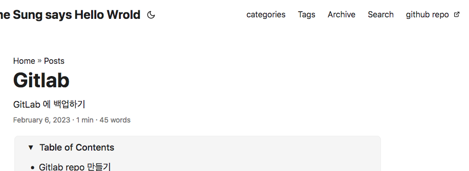

## 주요 사이트 
기본 사이트 : <https://github.com/adityatelange/hugo-PaperMod/wiki/FAQs>  
sample site : <https://adityatelange.github.io/hugo-PaperMod/>  
Repository : <https://github.com/adityatelange/hugo-PaperMod>  


* hugo 폴더의 posts, post 폴더 기준으로 메뉴구성을 해 준다. 
* 그 외 폴더 (예: docs) 는 hugo.yml 의 params : mainSections: 에서 정의 한다.


## hugo.yml for hugo-book
[paperMode 샘플 hugo.yml](https://github.com/adityatelange/hugo-PaperMod/wiki/Installation#sample-configyml)

* 지금 사이트 설정 (yml, toml, json 지원)

```yaml
baseURL: https://smjune.github.io/Hello_world/
# languageCode: en-us
title: MyoungJune Sung says Hello Wrold
theme: 'PaperMod'

taxonomies:
  category: categories
  tags: tags
  
menu:                   # to display menu on top-left side of site.
  main:
    - identifier: Categories
      name: categories
      url: categories/
      weight: 5
    - name: Tags
      url: tags/
      weight: 10
    - name: Archive
      url: archives/
      weight: 20
    - name: Search
      url: search/
      weight: 30
    - identifier: GitHub
      name: github repo
      url: https://github.com/smjune/Hello_world/
      weight: 40
      
outputs:
  home:
    - HTML
    - RSS
    - JSON # is necessary

Paras:
  defaultTheme: auto 
  
  DateFormat: "January 2, 2006"
  
  ShowReadingTime: true
  ShowPostNavLinks: true
  ShowBreadCrumbs: true
  ShowCodeCopyButtons: true
  ShowToc: true

# you can add more option here   
```
* Site 예  


### Archives & Search  
[Archives 가이드](https://github.com/adityatelange/hugo-PaperMod/wiki/Features#archives-layout)  
[Search 가이드](https://github.com/adityatelange/hugo-PaperMod/wiki/Features#search-page)   

### taxonomies  
Categories & Tags 는 branch bundle 로 구성한다.   
[가이드](https://gohugo.io/content-management/taxonomies/#default-taxonomies)
## Pages Front matter
각 pages (md 파일) 에서 pages 에 대한 설정값을 조정한다.  
[샘플 front matter](https://github.com/adityatelange/hugo-PaperMod/wiki/Installation#sample-pagemd)

### Categories & Tages
각 페이지에서 해당 페이지에 대한 category 와 Tags 을 설정  

```yaml
Categories: "Posted"
Tags: ["Big Data","한글","Minority",]
``` 
---

## Shortcode

### Mermaid
[참고 사이트](https://github.com/adityatelange/hugo-PaperMod/discussions/853)
1. create "layouts/shortcodes/mermaid.html"
2. add 
```html 
<div class="mermaid">
    {{ .Inner }}
</div>
```
3. "$ cp themes/PaperMod/layouts/partials/extend_head.html layouts/partials/extend_head.html"
4. add
```html
{{ if or .Params.mermaid .Site.Params.mermaid }}
<!-- MermaidJS support -->
<script src="https://cdn.bootcdn.net/ajax/libs/mermaid/9.1.6/mermaid.min.js"></script>
<script>
    mermaid.initialize({
        startOnLoad: true,
        theme: localStorage.getItem("pref-theme") === "dark" ? "dark" : "forest" 
    });
</script>
{{ end }}
```
5. add "mermaid: true" on front matter of pages.

## partial

### Comments

1. giscus 

utterances 와 생성 방법이 동일하다.  
[Giscus 셋업](https://giscus.app/)  

add **"layouts/partials/comments.html"** and paste code provided by your comments provider    
```html
<script src="https://giscus.app/client.js"
        data-repo="YOUR_REPO"
        data-repo-id="YOUR_REPO_ID"
        data-category="General"
        data-category-id="DIC_kwDOBIoCYM4CUfX_"
        data-mapping="pathname"
        data-strict="0"
        data-reactions-enabled="1"
        data-emit-metadata="0"
        data-input-position="bottom"
        data-theme="preferred_color_scheme"
        data-lang="en"
        crossorigin="anonymous"
        async>
</script>
``` 
also in config add this  
```yaml
params:
    comments: true
```


