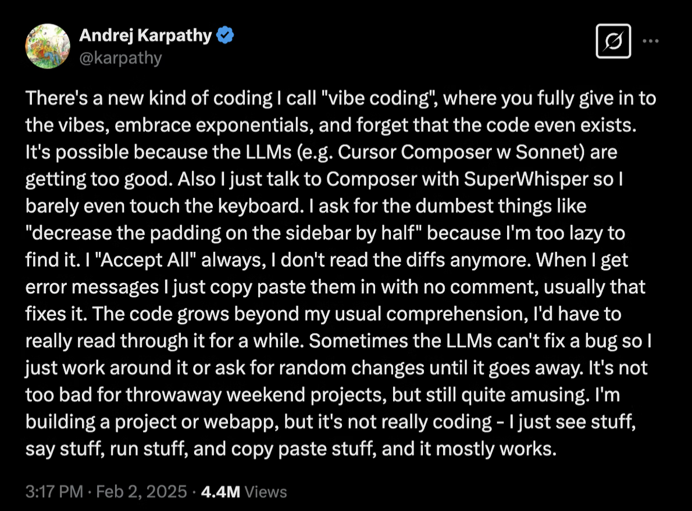

## What is Vibe Coding

### Essence and Accident

- Pair programming with AI generating code ?
- Assembly 으로 코딩하던 사람이 C 로 코딩하는 것을 보고 어떤 생각이 들었을까? 
- 제품을 위한 코드들 보다는 제품 코드를 테스트 하는 코드를 생산
- 어떻게 내가 의도하는 코드를 LLM 이 생산하도록 만들것 인가?
	- agent, prompt, context aware, ... 
	- 
### Tools 

- Knowledge Management tool : Notion, Obsidian
- Access to an LLM : GPT, Claude, Gemini 
- AI Code Editor : Cursor, Windsurf
- IDE AI Extension : Continue, Cline, AutoPilot, Gemini Code Assist
- VCS : Git

## Pre-Vibe Coding Routine

### Ideation
	
- 당연히 구현하기 전에 계획은 중요하다. 
- Idea을 작성 지속적으로 구체화하고,
- 관련자료를 모으고 분류하고, 
- 정보들을 연결한다. 
- 이 모든걸 위해 Knowledge Management tool 이 필요함.

### Refs. Index

- Codebase indexing
- Online Refs. (e.g., Cursor|Docs)
	- Language Syntax Guide (e.g., Python)
	- Domain Knowledge (e.g., Scipy, Sklearn)
- Live Refs (e.g., MCP:Brave Search)

### Persona (Template)

- User (e.g., Cursor|User rules)
- Project (e.g., Cursor|Project rules)
	- ...
- Product (e.g., Product Requiremet Document)
	- ...

## Harmonize with SDLC 

-  Design - Code - Test - Build - Deploy
- Iterative incremental , evolutionary 
### Design

- PRD : Notion, Obsidian
- UI/UX : Figma 
- Diagram : UML, Mermaid

### Code 

- Choosing LLM Model
- Context-Aware
- Prompt Engineering
	- 잘통하는 prompt DB화 할것 
- Agentic approch
	- Access to resource (MCP) 
	- Make a Agent (ADK)
	- Connect to Agents (A2A)
- Managing Non-deterministic 
- Human-In-The-Loop
- Restore checkpoint

### Build

- Android Studio 
- XCode

### Deploy

- App
- WEB

## 추가 읽을거리

- [kakao AI blog](https://tech.kakao.com/posts/696)