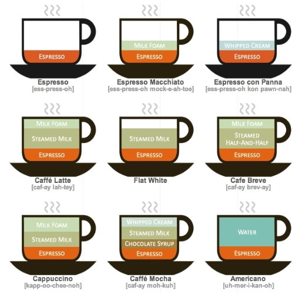
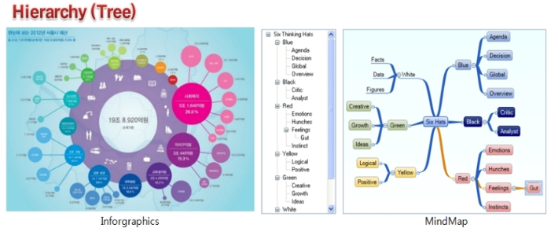
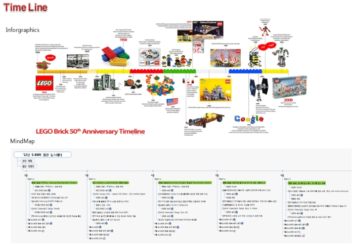

주변에 커피 전문점이 급속도록 번성하면서 커피를 마시는 기회가 많아졌다. 그 만큼 커피의 선택도 많아질 수 밖에 없을 것이다. 최근까지 달콤한 맛에 반해 '카페모카'를 즐겨 마셨지만, 정작 그 속에 뭐가 들어 가는지는 모르고 있던 차에 한장에 그림을 보게 되었는데, 이 그림을 통해 그 전에 그렇게 설명을 들어도 기억 나지 않았던 '카페모카' 의 내용물 (?) 에 대해 쉽게 이해 하게 되고, 예전 말로만 설명을 들었을때 처럼 기억 못하는 일이 없어 졌다.

최근들어 위와 같은 Data visualizatioin류 기술(?) 들이 사람들의 관심을 끌고 있다. 그 분야중 수 많은 관련 정보를 한장의 그림으로 표현하는 Infographics 는 그 효용가치에 많은 사람들이 사용하고, 급기야 서울시 12년 예산안 (아래 Tree 중 왼쪽 그림) 으로도 사용되기도 했다. 관련하여 지금 소개하는 동영상은 위 커피 그림을 그린(?) David McCandless (http://www.davidmccandless.com/ ) 의 TED에서 강연한 내용인데 그의 경력만큼이나 재미난 이야기들이 있다. 이 글의 제목과 대표 이미지인 '정보는 아름답다'  (Information is beautiful) 는 최근 그의 Infographics 의 사례집으로 아래 동영상에서 소개되는 흥미로운 사례들을 포함 하여 많은 그림(?) 들이 있다.  (참고로 이런 visual 류를 좋아하는 사람들이라면 www.visualizing.org 도 방문해 보는것도 좋다.)  

대부분의 사람들은 넘처나는 정보로 인하여 어려움을 겪고 있지만, 이를 해결하기 위한 간단한 방법이 있으며, 그것은 바로 지금보다 더 많이 시각을 이용하는 것이다. 정보를 시각화 하므로 패턴과 그 사이의 의미 있는 관계를 알아 낼 수 있습니다. 이를 더욱 그럴듯하게 만들거나, 이야기를 전달하게 하거나, 중요한 점에 집중할 수 있도록 디자인 할 수 있습니다. 그렇지 못한다 하더라도 그 차체로도 정보는 아름답습니다.  

이글을 읽는 대부분의 독자들이 저와 같은 Engineer 라는 점을 생각한다면, 지금까지의 이야기는 어떤 면에서 그림에 떡을 수도 있다. 물론 어느 누구에 뒤지지 않을 많큼 많은 데이터를 가지고 있고, 또한 관련자들에게 (혹은 이해 수준이 초,중학생 수준인 해당 영역의 비 관련자에게도) 그 내용을 요점만 정리하여 이해를 시켜야 하는 책임이 있음에도 불구하고 이러한 것들이 그림에 떡으로 밖에 느껴질 수 없는 이유는 아마도 본인에게는 그 만큼의 많은 데이터가 없다고 오해하거나, 본인에게 디자인이란 재능도 없고, 번거롭고, (공대생이였던) 대학시절 인문대 식당에서 밥을 먹는 것 만큼 오글거림을 주기 때문은 아닐까?  

먼저 몇몇분들이 지금 하고 있는 업무가 곤란을 겪을 만큼의 많은 량의 정보를 다루지도 않다고 생각하는 것에 데이터의 물리적 량으로만 기준을 삼는다면 옳은 말일 수 도 있다. 하지만 데이터의 량이 작다고 해서 그것을 정리하고 한눈에 보기 좋게 만들거나, 누구나 (초,중학생) 이해할 수 있는 정도의 그걸듯한 모습으로 변화 시켜야하는 필요성이 없다고 말할 수 없고, 또 조금만 더 주위를 둘러 보면 이미 충분한 데이터를 가지고 있게 마련이다. 하루에 받는 메일 수 하며, 내가 작성하는 문서, 그리고 그 속에 담긴 관련 정보들을 하나 하나 나열하다 보면 충분히 시각적인 요소가 필요하다는 것을 느낄수 있을 것이다. 그래도 데이터량이 작다고 생각이 든다면 하루, 한달, 일년의 긴 시간을 두고 진행하는 롱텀 업무에 대해 생각해 보길 권하겠다.  

그리고 두번째로 디자인이라는 미적요소에 대해 '엔지니어들이 어떻게 디자인을 할 수 있겠는가?' 라는 의문에 대해서도 충분히 동감한다. 하지만 디자인을 보는 관점을 적절한 요소들의 선정과 배치 라는 keyword만을 놓고 본다면 이야기는 달라질 수 있다. 물론 색감, 다양한 도형과 이미지, 일러스트와 같은 미적인 요소를 배제하고서 디자인이라 말할 수 없다라고 생각 할 수도 있다. 그러나 정작 중요한 것은 내가 전달하고자 하는 의미에 맞게 각 요소들이 나눠져 있고, 또한 적절히 모아져 있으며, 이것들이 보기 좋게 배치 되어 있는가을 생각한다면 이 디지인이라 요소도 그렇게 어려운 요소만은 아닐것이다.  

그렇다고 엔지니어도 디자인을 배워야 한다고 주장하고 싶지는 않다. 몇 해 전에는 이공계에게 글쓰기를 강조하던 분위기였는데 거기에다 이젠 디자인까지 ... 물론 글쓰기와 디자인적인 Liberal 한 재능이나 소양이 이미 있다면 고마운 일이지만 어찌되었건 이공계 출신으로써 살아가기가 점점 힘들어지는 것 같다. 그렇다고 언제까지 새로운 트랜드를 강건너 불구경하듯 뒷짐지고 바라만 보고 있을수는 없는 노릇이기에 우리의 도전은 또 시작된다. 이런 도전을 쉽게 해결할 수 있는 방법을 하나 제시한다면 바로 Mind Map 이다. 넘처나는 정보의 시대에 한사람이 다루어야 할 정보의 량이 몇년전 보다 몇 배는 증가한 상황에서 이를 적절히 시각화해야 하는 필요성은 날로 높아만 지고 있다. 이를 쉽게 지원해 줄 수 있는 툴이 Mind Map 이다. 굳이 예쁜 디자인이 들어가지 않는다 하더라도 충분히 시각화에 의한 전달력에 있어서 경쟁력이 있다.  

## Infographics
Infographics의 구성을 가만히 살펴 보면 Mind Map에서 제공하는 포맷과 매우 유사한점이 많다. 그렇다고 해서 Infographics 에서 제공하는 Full HD급 이미지를 완벽하게 재현 할 수 있다는 듯은 아니다. Liberal 한 요소에 목마른 엔지니어들의 목을 축일 정도의 디자인적 요소를 갖추고 있는 것으로도 충분히 사용해 볼만하다.  

여러가지 형태의 Infographics 가 있을 수 있지만 대표되면 몇가지를 추려 보면 Tree 형태, Time line 형태, Clustering(constrast) 형태로 분류할 수 있는데. 이런 형태는 쉽게 Mind Map 으로도 표현이 가능한 부분이다. 

### Hierachy (Tree)
아래 그림을 보자 왼편에 Infographics와 오른편에 그와 유사한 Mind Map 형식을 배치해 보았다. 혹시 왼편의 Infographics을 만들기 위해 디자이너에게 보낸 원장(Origial content) 의 모습이 혹시 오른편의 Mind Map 이 였다면 이것을 받은 디자이너도 심미적인 요소만을 고려하여 쉽게 디자인 할 수 있지 않을까? (She said ... 도 들어봐야 하겠지만 말이다.)  

큰 의미를 중앙에 배치하고, 서브 요소들을 Tree 형태로 배치하는 것은 Mind Map의 큰 특징이기고 하다. Table (표) 형태와 쉽게 컨버전 되는 형태이기도 하다. 

### Time Line
두번째는Time Line 형태로 변화된 모습이나 사건을 시간의 축으로 배치하는 형태이다. (공간의 제약상 좌우가 아닌 상하로 배치함)

### Clustering
세번째는 군집형태이다. 위 Tree와 다른 점이라면 중심에 서브를 배치하기 보다 관계를 표현하는 것이다. 군집 표현에서 각 노드의 색을 군집별로 같은 색으로 지정한다면 쉽게 구분이 될 수 있으므로 적극 활용하기를 권한다.  

최근들어 Infographics와 비슷하게 많은 관심을 받고 있는 Social Service 가 있는데 바로 "Curation" 이다. Pinterest (www.pinterest.com) 로 대표 되는 Curation 은 이미지 중심의 의사전달 방식의 Social Media에서의 본격적인 진입이라 볼 수 있다. *(패션, 여행, 음식, 인테리어 등 여성이 관심이 많은 분야중심으로 활용되는터라 타 SNS(Google+ 는 남탕)와 비교하여 여성의 비율이 높다는 요소도 흥미로운 점이지만)* 이제는 140자 단문도 길어서 한장의 이미지로 의사소통을 하는 것을 선호하는 것을 볼때 더욱 Infographics의 활용은 증가 할 것이다. 나 자신도 어느때 부터인가 Text 검색 보다 Image 검색을 더 선호하고, 바로 Text 검색을 하기 보다 이미지를 먼저 찾은 다음 그와 연결된 text cotent를 찾아가기 시작했다. (이미지 검색 후 해당 이미지를 가지고 있는 뉴스, 블로그 등 으로 이동 한다.) 이제는 글을 쓰더라고 자신의 글을 대표하는 이미지 없이 글을 쓴다는 것은 바다를 향해 소리치는 공허한 메아리가 되는 것은 아닌지 고민해 볼만하다. 