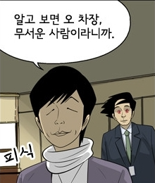
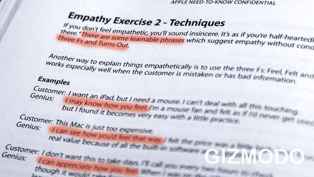
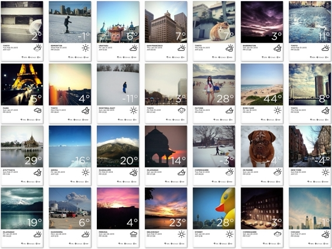

>"소비자는 자신이 원하는 것을 직접 보기 전까지는 자신이 무엇을 원하는지 조차 모른다"  

사실 이런 명제에 대해 오래전부터 마케팅쪽 (소비심리학에서는 '소비자의 말을 믿지 말라' 라고 말한다) 에서 논의되고 있고, 계속해서 연구되었던 것이였는데, 어느순간 오로지 한 개인의 경영철학처럼 뉴스에 회자되면서 유명해 졌다.  

처음 이말을 들었을때 나는 무척 혼란스러웠다. 회사에서 제품을 만드는 일을 하고 있는 사람이지만, 나 또한 한 사람의 소비자이기도 하기 때문이다. 과연 나도 내가 원하는 것을 직접보기 전까지 내가 무엇을 원하는지 모르고 있는 걸까? 그렇다며는 왜 그런것일까? 생산/소비의 영역에 대해서만 그런것일까? 과연 이 말을 사람들 속에서 살아가는 한 사람으로써 어떤 의미로 받아 들여야 할찌 무척 당황스러웠다.  

나는 이 문장을 오로지 이해하기 위해 범위를 확대시켜 쉽게 이해할 수 있는 단순한 문장으로 바꿔 보았다.   

### "사람들은 자신이 무엇을 원하는지 모른다."  

※ 아래 동영상 줄거리

   어느 한 노인이 길거리에서 도움을 구하고 있다. 그는 더군다나 앞을 보지 못한다.  
   'I'm Blind, Please help' 라고 써있는 푯말을 있었지만, 그의 주변에 어느 누구도 그에게 별로 관심이 없다.  
   어느 한 여성이 그에게 관심을 보인다.  
   그러곤 그와 세상의 유일한 소통도구인 푯말에 무언가를 열심히 쓴 후 사라진다.  
   그녀가 사라진 뒤 무슨 마법의 가루가 뿌려진 것처럼 사람들이 그에게 도움을 주기 시작한다.  
   그녀가 다시 돌아오고 그 앞에 섰을때 그는 묻는다.  "도대체 내 푯말에 뭐라고 썼나요"  
   그녀는 "같은 말이에요. 저는 단지 단어만 바꿨을 뿐이에요" 라고 말한다.  

:clapper: 동영상 보기 : http://www.youtube.com/watch?v=CKvvSLC29Ws  
:no_entry_sign: **(2023.2 안타깝게도 현재 이 동영상은 사라지고 없다.)**  
  

흔히 사람들이 원하는 것이 '진실' 혹은 '사실' 이라고 믿고 있다. 다시 말해 '진실', '사실' 만으로 사람들이 행동을 유발시킬 수 있다고 믿는 것이다. 하지만 그것 만으로는 부족하다. 사실을 이해한다고 해서 쉽게 행동으로 이어지지는 않기 때문이다. 위 동영상에서 주변 사람들이 혹시 이렇게 생각하고 있지는 않은지...."당신이 앞을 보지 못하는 것은 사실이고, 이해했습니다. 그러나 왜 도움을 주고 싶은 마음이 생기지 않을까요?" 

항상 옳은 일이라고 생각된다고 반드시 이루어 지는 것은 아닌듯 하다.  전 직장에서 업무 프로세스를 바꾸면 업무가 쉬어지고, 효율적으로 변화 될 수 있다는 것을 많은 현장 실무자들 (주로 '현업을 모른다'라는 이유로 반대하는 사람들) 에게 설득해야만 했다. 이를 위해 나는 회사내 데이터들을 모으고, 이를 거부할 수 없는 공학이론에 입각하여 증명을 하려고 전전긍긍하고 있었을때, 사장님께서 오시더니 이런 말씀을 하셨다. 그 때는 절대 이해 할 수 없었던 말...  

>"이론으로 증명해 내려고 하지 마라. 이미 이론은 많은 사람들에게서 옳다고 증명되었다.  
자네가 좋다고 느낀것을 그들도 똑같이 느낄수 있는 방법을 찾아봐라"  
**( 2023.2, 지금 생각해 보니, 에토스/파토스/로고스 에 관하여 말씀해주신 것 같다.)**

  
출처: 다음 웹툰 '미생' 120수 중에서,  그때 나도 오차장의 노하우 "감정적 지불"을 알았더라면  
*(※ 감정적 지불 : '스튜어트 다이아몬드'의 저서 '어떻게 원하는 것을 얻는가'의 협상 전략 중 청취자가 감정적으로 변하면 상대의 말을 듣지 않게 되므로, 공감과 사과와 같은 행동으로 청취자가 다시 이성적인 판단을 할 수 있도록 유도하는 것을 말함.)*  

혹시 동영상의 사람들과 전 직장의 동료들을 포함하여 사람들은 '사실의 전달, 이해' 보다 '감정의 공유, 감동'을 더 원하고 있는 것이 아닐까? 따라서 나는 위의 명제를 다시 바꿔보았다.  

### 사람들이 원하는 것은 '사실의 전달 보다 감정의 공유'이다. 그러나 그것을 본인 조차 인정하지 않는다.  

>"아빠 무서워 ~ "  

어린 아들이 천둥 :boom: , 번개 :zap: 가 치는 밤이 무섭다고 한다. 진정 이 아이가 원하는 것은 무엇일까?  

>"구름이 움직이다가 아래쪽으로 (지면) 음전하 채워지고 위쪽은 양전하로 대전된단다.  이때 아래쪽의 음전하와 땅 위의 양전하의 기전력의 차이에 의해 방전이 일어나게 되는데 이것을 번개라고 해. 천둥이라는 것은 번개가 나타날 때 같이 나타나는 소리인데 번개가 칠 때의 30000K의 고온이 발생하기 때문에 주변 공기가 팽창하게 되어 천둥을 울리게 되는 것이야. 단순한 기상 현상이니까 무서워할 필요 없어."  

아이가 원하는 것이 위와 같은 기상현상의 과학적 설명 아니면 '번개는 하느님께서 사진찍으시는 것이니 무서워 말고 웃어 "김치~" '류의 허무 개그는 아닐 것이다.  

출처: '하늘이 보내준 딸' [네이버 영화](http://movie.naver.com/movie/bi/mi/basic.nhn?code=88783)   

아이가 원하는 것은 감정의 공유. 즉, 자신의 공포감을 같이 공감해 주고, 보살핌 (사랑) 을 달라는 것이다. 그냥 아무말 없이 꼬~옥 안아주는 것이 최선이 아닐까? '애야 사실은 아빠도 무섭단다. 하지만 우리 같이 있으니까 혼자 일때 보다 무섭지 않는데.' 라고 이야기 해주면서 말이다. (그런후 점진적으로 번개가 무서운개 아니라는 것을 좋아하는 캐릭터를 이용하여 설명해 주거나, 관련 책을 함께 일어주면 좋다.)  

아이들은 표현에 솔직하다.  자신의 감정을 있는 그대로 반복적으로 표현한다. 아이들보다 더 능숙한 협상가를 나는 본적이 없다. 자신이 원하는 것을 정확하게 알고 있으며, 어떻게 하면 쉽게 얻어낼 수 있는지도 잘 알고 있다. '국내 약 60% 초등학생이 오늘처럼 천둥번개가 치는 밤을 무서워 하고, 성인의 약 20%도 그렇다는 조사 결과가 있습니다. 초3학년인 제가 오늘 같은 밤 무서워 하는것은 당연합니다. 그러니 ... ' 라고 사실적이고, 객관적이면서 이성적인 대화를 시도하진 않지만 적어도 자신의 감정에 솔직하다. 계속해서 '무서워, 무섭단 말이야' ..... 만 소리를 지르며 되풀이 하면서.  

    언제부턴가 우리는 자신의 감정을 숨기고 이성적으로 살아야 한다고 배워왔던것 같다. 그리고 그 배움의 결과로 우리 사회는 좋아지고 있으며, 더 합리적으로 바뀌었다고 생각한다. 그리고 사람들은 자신이 늘 이성적이고, 또 그래야만 한다고 생각한다. 하지만 사실은 감정적인 것에 더 영향을 받고 있다. 우리가 무언가를 판단하고 선택하는데 있어서 이성적이기보다 감성적인면에 의해 결정한다는 것에 동의를 못하시겠다면, 한가지 예를 들어 보겠다.  

사람들은 자신이 이성적이라고 생각하지만, 감정에 얼마나 많은 판단과 선택을 맞기고 있는지 모르고 있다.  

### Empathy : 사람들을 움직이는 마술 같은 힘  

    거금을 주고 산 휴대폰이 간단한 버튼이 고장이 났다고 하자, 당신은 AS센터에 가서 고장난 버튼에 대해 이성적으로 당신이 무상 수리를 받아야 한다는 것에 대해 논리적으로 설명할 것이다. 그러면 센터 직원은 고장의 내용을 확인하고, 버튼의 제질은 어떻고, 가공한 기술이 저떻고 하며 논리적이고 합리적인 설명과 함께 수리를 해 준다. 당신은 만족하였는가?  

  
*※ 최근 기즈모도 기사에 등장한 고객 대응 매뉴얼을 보면, 먼저 고객과 감정을 공유해야 한다고 적혀 있다.*   
출처 :'How To Be a Genius: Secret Employee Training Manual  

어쩌면 당신은 AS센터에서 보상받고 싶은것은 완벽한 제품의 수리가 아닐것이다. 혹시 당신의 마음에 난 상처(?)에 대한 공감일것이다. 더 정확하게 자신이 했던 판단에 대한 또 한번의 확신이다. 100만원이나 되는 제품을 사기위해 무수히 많은 정보를 검색하고, 주변의 의견을 듣고, 먼저 구입한 사람의 것을 써보면서 이것 저것 장단점을 비교한 후 결정을 내렸을 것이다. 자신의 결정으로 산 제품이 단 일주일만에 고장이 났다는 것은 자신의 결정이 틀릴수도 있다는 것을 의미한다. 비록 AS 센터에 가서 버튼이 튼튼하지 않다는등 불만을 이야기 하지만, 정작 원하는 것은  

>'제가 이제품을 사기위해 몇달을 고민하고, 몇일간 정보를 분석하여 결정한건데 일주일만에 고장나면, 저는 제대로 물건을 보지 못하는 사람이 되어 버립니다. 「내가 한 판단이 옳으며 나는 물건을 제대로 고를줄 아는 사람이다」 라는 신념(혹은 자부심)이 받은 상처를 치료해 주세요'  

일 것이다.  

그러나 절대 그렇게 말하지 않는다.  
(적어도 내 경우는 이렇게 말하고 싶지만, 바보 취급 받을것 같아서 말하지 않는다.)  

비슷하게 쿼드코어, HD 아몰레드, 이런 기술적 설명들은 사용자에게 의미가 없어 보인다. 문제는 그것들이 나를 얼마나 Cool 하게 보여지게 만들어 주느냐인 것이다. 감정을 이해하기보다, 사용자의 만족감을 추구하기보다 (그럴려면 많이 들어야 한다.) 기술을 뽐내기 위해 지식을 장황하게 설명하지는 않았는지 반성해 봐야 한다.  

### 배 만드는 법을 알려주지 말고, 바다에 대한 동경을 심어주어라  - 생떽쥐베리  

    소프트역량이라는 의미를 나 나름대로 생각해 본다면 지금까지 말한 감성을 중심으로 한 접근방법을 말하는 것이 아닐까 생각한다. 최근 감성마케팅 (emotional marketing) 은 좋은 예 일것 같다. "이런 차를 타고 다니면 이런 이미지로 당신은 다른 사람들에게 보여질 수 있습니다. " ~ 류의 광고가 많은 이유이다. 브레이크가 어쩌구, 강판이 저쩌구, 엔진이 이러쿵 저러쿵.. 다 쓸때 없는 이야기이다. 우리는 물건을 사기도 하지만 그 물건이 주는 이미지를 사기도 한다. 퇴근한 남편 혹은 아빠가 뜬굼없이 시금치 한단을 사왔다. 왜 사왔냐고 했더니, 오는길에 할머니가 야채를 길에서 팔고 계시는데 돌아가신 어머니 생각이 나서 그냥 샀다는 것이다. 이 사람은 시금치를 산것이 아니라 어머니에 대한 그리움을 (감정) 산것이다.  

이제 글의 마지막으로 가면서 나에게는 2가지 질문이 남는다.  

* 첫째는 사람들이 원하는것, 정확하게 공유하고자 하는 감정을 쉽게 찾아 낼 수 있는 방법은 무엇일까?  
* 둘째는 내가 느낀것(혹은 찾아낸것)을 다른 이들도 똑같이 느끼게 할 수 있는 방법은 (어떤한 행동을 유발하기 위해) 무엇일까?  

  
출처: 감성이 더해진 날씨 정보 www.takeweather.com  

:snowman: :sweat_drops: *얼음이 녹으면 ..., 뭐가 되는지 알아?...*  

    첫째 질문에 답은 대상에 대한 많은 정보가 바탕이 되어야 한다는 것이다. 지니어스들의 매뉴얼 사례 (Human Beings 101 부분) 에서 보여지듯이 사람들은 자신이 원하는 것을 정확하게 표현하지 못한다 하더라도 사람들은 자신이 원하는 것에 대한 무수한 많은 흔적을들 (혹은 무의식적 행동) 남기게 된다. 이런 흔적을 초능력과 같은 신비한 힘으로 알아차리는 사람들도 있었지만, (우리들도 대상이 가족, 친구 혹은 적을때는 쉽게 가능하겠지만, 불특정 다수의 수백,수천만명을 대상으로 한다면 전문가에게 의뢰해야 한다.)  

최근 디지털 소비가 증가하면서 사람들이 무의식중에 남긴 디지털 부스러기들을 차곡차곡 쌓고 이를 분석하므로 어느정도 예상할 수 있게 되었다. (맨 위 동영상에서 푯말을 고친 여성이 주변 사람들이 좋은 날씨에 대해 다른 친구들과 주고 받는 Twitter 나 Facebook, 혹은 takeweather (http://www.takeweather.com/) 을 분석해서 공감 포인트인 "날씨" 를 찾은건 아닐까 상상해 본다. 물론 직감적으로 그것을 알아 감지해 내는 사람도 있다.) Big Data를 이용한 소비자의 행동 패턴을 분석하는 것도 어쩌면 사람들의 감성적 성향, 공감 포인트를 찾기위함인 것이다.  

  
*※ 우리는 이런 bond 가 없기에 교감하기 위해 뭔가 다른 방법이 필요하다.*  
출처 : Naver 영화 AVATAR 2009 중  

    이렇게 얻어진 대상 감정를 쉽게 공감하게 만드는 방법중에 하나는 바로 이야기를 이용하는 것이다. 생떽쥐베리의 말을 바탕으로 생각해 보면, 어떻게 바다에 대한 동경을 심어 줄것인가를 생각해 보면 간단하게 답이 나올것 같다. 바다에 관련된 영웅전, 탐험가들의 이야기를 이야기해 주고, 아름다운 바다의 모습 사진, 그림을 보여 주면 가능 하지 않을까? 심적 이미지를 이용한 이야기전달이 사람들로 하여금 쉽게 공감을 얻을 수 있을 것이다. (이미 우리는 어렸을때 동화책을 보며 익숙해져왔던 것들이다. 그런데 왜 어른이 되어선 잊고 지냈을까? 아마도 성장하면서 이성적이어야 한다는 것을 강요받은 것은 아닐런지) 이야기로 전달 할때 몇가지 Tip이 필요하다. 먼저 이야기에는 주인공이 있어야 되며, 그 주인공의 새로운 도전과 방해 세력, 이들과의 갈등과 극복이 있어야 한다.  

(누군가를 설득하고, 생각과 행동의 변화를 이끌어 내기 위해서는 진심어린 감정의 공유 (공감) 와 이를 전달할 수 있는 심적 이미지, 그리고 이야기가 필요하다. 그것이 사람들이 진정 원하는 것이다. )  