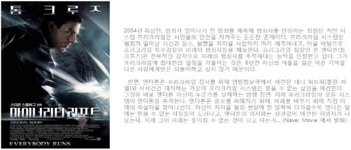
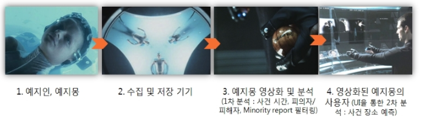
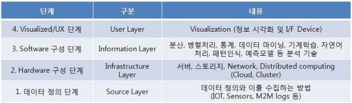
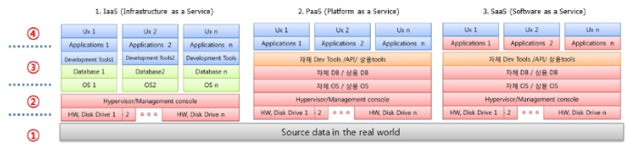
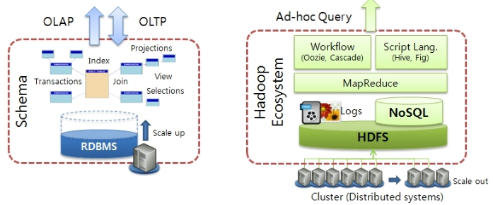
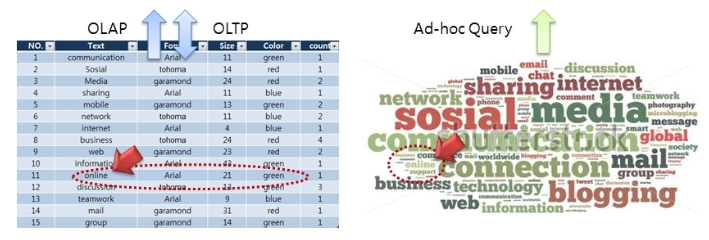
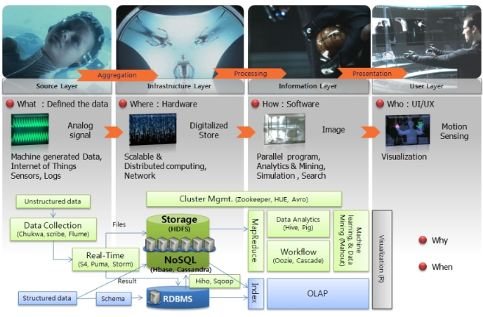

    인터넷의 발달 이후로 우리들은 많은 데이터 속에서 살아가고 있습니다. 더욱이 모바일 기기의 출현은 데이터의 증가 속도를 더 빠르게 진행시키고 있으며, 발생되는 량 또한 기하급수적으로 증가 시키고 있습니다. 따라서 다양한 Digital device 을 통해 발생되는 데이터 속에서 자신이 원하는 정보를 찾는 일은 점점 더 힘들어 지고 있다는 것은 사실입니다. 반면 이런 변화가 그져 고통스럽고, 억울하기만한 상황이 아닌것 같습니다. 위기가 곧 기회이듯, 이런 변화의 중심에 있는 바로 그 데이터를 적절히 가공한다면 의미 없고, 짜증의 대상이였던 것들 속에서 지금까지 알지 못했던 새롭고 흥미로운 Insight을 발견할 수도 있기 때문입니다. 이런 데이터 홍수 속에서 새로운 Insight를 찾으려는 노력들은 최근 들어 많은 글로벌 Top 기업들의 사업영역 변화 혹은 확장으로, 또는 수 많은 Start Up 의 기회로 시도 되고 있습니다. 그들이 찾고자하는 Insight 란, 주로 미래 예측 입니다.  

* Scenery  

    몇년전부터 'Big Data' 로 불리우기 시작한 이러한 IT 트랜드가 이미 약 10여년 전에 제작된 영화 속에서 다루어 졌다면 믿으시겠습니까? 제작된지 10년이 지났음에도 불구하고 ( *2023년 현재, 이 글을 쓴지도 벌써 10여년이 지났다* ) 지금의 시각에서 봐도 시대에 뒤떨어지기는 커녕 아직까지도 그 예언의 유효함에 감탄할 수 밖에 없었던 영화 ... 'Minority Report' (2002) 

    캐캐묵은 영화 이야기를 꺼내는 이유는 영화속에서 표현된 범죄 예측 시스템이 주었던 Insight 때문이다. 영화에서 표현된 범죄 예측 시스템인 Precrime 시스템은 그 구성과 운영원리가 다음과 같다. 미래를 볼 수 있는 3명의 예지인(Precog)들이 유동액 풀에 반의식 상태에서 꾸는 예지몽은 기계장치에 의해 범죄 예방 경찰국 (Precrime) 컴퓨터에 연결되어 영상화된다. 바로 이 예지인(Precogs)들이 꾸는 예지몽을 소스로 하여 이를 모으는 한편 동일한 꿈을 꾼 경우 피해자와 피의자의 이름을 나무공에 각인하고, 또한 그 유명한 모션 UI로 단편적인 영상을 조합하여 사건의 정황을 분석, 범죄 현장을 찾아내어 범죄 발생 이전에 피의자 ( 용의자가 더 맞을듯 합니다) 를 체포하게된다. 이 과정 중 대개 세명의 예지인(Precogs)들이 동일한 미래를 보지만 예언이 엇갈리는 경우나, 전의 것과 비슷한 영상들은 이미 해결된 사건을 중복해서 꾸는 Echo Image라 하여 소수의견(Minority Report )으로 간주, 파괴한다. 이와 같은 일련의 Pricrime 시스템의 과정은 아래 그림과 같이 4부분으로 간단하게 표현할 수 있다.    

* 네가지 : 수집,저장,분석,표현

    이러한 4단계 구성은 상당히 논리적인 시스템 운영 구조로 받아들여진다. (영화 저변에 깔린 논리를 파헤쳐 보는 것도 재미난 일이다.) 첫번째로 보이는 항목은 "① 명확한 소스 (수집 대상)  데이터 정의"이다. 3명의 예지인들(Precogs)에서 발생하는 예지몽이 그 대상이라 할 수 있다. 두번째로 그런 예지몽을 "② 수집,저장하는 기기 장치들" 이다. 예지인(Precongs)을 위한 가수면 유지 장치부터 인체에서나오는 신호를 수집하고 이를 메인 컴퓨터로 전송, 저장하기 까지의 모든 인프라가 이에 속한다. (아마 이때 아니로그 신호로 수집되었던 인체신호들을 디지털화된 데이터로 변환했을 것이다) 세번째가 디지털화된 데이터을 여러가지 변환, 분석 알고리즘 이용해 영상화하고, 이를 "③ 적절히 분석하여 정보"로 만들어 내는 단계이다. (사건 시간, 피의자/피해자 파악, Minority report 필터링 등 기계적인 1차분석 수행) 마지막으로 시스템 사용자에게 Insight (영화에서는 사건 장소를 ad-hoc query로 찾을 수 있도록 하는 것이였죠) 를 줄 수 있는 "④ Visualization 및 UI " 단계가 될것이다. (영화에서 가장 볼거리가 많은 부분이고, 대표되는 장면이기도 하다.)   

    다소 복잡해 보일 수도 있는 Pricrime 시스템을 '예지몽 데이터를 수집, 저장하고 이를 적절히 변환, 분석하여 미래에 발생될 범죄에 대한 정보를 제공하는 System' 으로 간단하게 표현해 본다면, 여기서 '예지몽'과 '범죄'라는 특정 단어만을 변경하였을때 'Pricrime 시스템' 이란것은 앞서 말한 IT분야에 최고의 관심사인 Big Data 가 말하는 것과 매우 흡사하게 보여진다. 다시 일반화된 용어로 바꾸어고 앞에 '빅' 자를 넣어서 다시 읽어 보면 "빅 데이터 소스를 수집, 저장하고 이를 적절히 변환, 분석하여 미래에 대한 Insight를 제공하는 System". 적어도 나에게는 그럴듯해 보이고, 뭔가 그 자체로도 Insight을 주는듯 하다. 그렇다면 위의 Pricrime 시스템의 4단계 구조를 기초로 하여 대부분 사람들이 이해하기 쉽게 일반화된 Big Data 시스템의 정형적인 모습으로 표현해 본다면 아래 표와 같이 정의할 수 있지 않을까?  

>1단계는 데이터 다양한 형식에  (M2M Log, Signals, Image 등) 따라 그만큼의 다양한 수집방법이 존재  
>Hodoop은 분산 시스템을 포함하고 있지는 않지만, 분산 시스템에서 운영되기에 한꺼번에 고려되어야 함.  
>4단계는 분석에 목적에 맞는 적절한 사용자 인터페이스가 적용되어야함.  

    위의 표에 언급된 내용 이외에 각 단계별로 더 고민해 봐야 할 사항들이 있는데. 먼저 1단계에서는 데이터를 수집함에 있어 추가적인, 인위적인 작업이 없어야 한다는 것이다. 구체적인 예를 든다면 IOT (Internet of Things, 관련글 ) 기반의 Life logging과 같은 센서 및 M2M log 수집 환경 등이 될것이다. (Crowdsourcing 기반으로 인류의 일상에 대한 데이터를 모아 분석해보는 The Human Face of Big Data 라는 재미있는 project도 있다.) 만약 영화에서 예지인들이 예지몽을 꾸고 그 것을 문서로 작성하여 컴퓨터에 입력한다고 가정해 본다면 이 단계에서 꼭 풀어야 할 문제가 무엇인지 쉽게 상상할 수 있을 것이다.  

2단계에서는 수집 가능한 모든 데이터를 저장하기 위해 확장이 자유로운 Infrastructure 가 지원되어야 한다. 어떤 이유에서든 그동안 수집하지 않았던 다양한 형태의 대용량 데이터들을 빠른 주기로 즉시 저장하어야 하기 때문에 필요할 때 바로바로 확장할 수 있는 서버가상화 기반의 Cloud Computing 기술이 제시되고 있는 이유이기도 하다. (뒤에 언급하겠지만 Big Data Service를 다양한 Cloud 형태로 제공하는 기업들이 등장하고 있음)

> Big Data 서비스도 2단계 인프라 (H/W) 뿐만 아니라 3단계 분석 플랫폼, 4 단계 Application 까지 Cloud 서비스가 확대 됨.  

    즉, 가상 서버로 Scale-Out이 자유로운 원격 분산 Cluster 구성이 채택되고 있는 것이다. 3단계에서는 이런 원격 분산 Cluster에 데이터를 저장할 수 있는 파일구조와 이를 병렬 처리할 수 있는 다양한 분석 방법이 (Software Platform) 필요하다. 바로 이러한 이유 때문에 Apach Hadoop Project (관련 사이트)가 주목을 받기 시작했고, 이제는 Big Data 를 언급하면서 빼놓고 말할수 없는 것이 되어 버렸다. Hadoop의 등장으로 비로소 Big Data 에 대한 가시적인 실체가 나타나기 시작한 것이다. (영화에서 표현된 상상이 이제 서서히 현실화 되기 시작한 것이다.)  

따라서 2,3단계는 Hadoop으로 대표 될 수 있다고 생각한다. 마지막으로 4단계에서는 결과를 시각화 하고, 분석결과가 잘 전달되기 위한 사용자 UI가 필요하다. 영화에서는 분석 결과인 동영상를 잘 다룰 수 있게 모션 UI을 채택하였다. 이런 인터페이스가 아닌 마우스로 클릭를 해야만 하는 인터페이스이였다면 우리가 느끼는 시스템 전체의 이미지가 반감되었을 것이다. 더불어 서로 다른 영역의 분석결과를 쉽게 Mash up 할 수 있는 기능도 좋을 것 같다.  

* 네가지 중 두가지 : 분산시스템과 병렬처리  

    'Big Data가 Hadoop이고, Hadoop이 Big Data 이다' 라고 할 정도로 성장한 Hadoop은 앞에서 정의한 Big Data 구성의 2,3단계를 대표할 수 있다라고 생각한다. 이러한 생각은 Hadoop Ecosystem 관점에서는 1,4단계에 대한 다양한 모듈도 제공하지만, 핵심은 HDFS (Hadoop Distributed File System)과 MapReduce 이기 때문이다. Hadoop의 탄생 계기는 서버 및 스토리지의 운영비, 즉 바로 '돈' 때문이다라고 주장한다면 너무 지나친 표현일까? 그렇다면 '기존 스토리지 운영(Scale-up)의 한계와 이를 위한 운영비 증가'로 좀 순화하여 표현해야겠다. 하여튼 이런 문제를 본격적으로 다루기 시작한 업체들은 이런 운영비에 민감할 수밖에 없는 Google, Yahoo와 같은 검색 솔류션 업체들이였다.  

그야말로 World Wide Web에 있는 어마어마하고 다양한 데이터 정보를 저장하고 그것을 분석, 분류하기 하기 위해서는 기존의 RDB 기술로써는 한계가 있었다. (이후 Facebook과 Amazon으로 확대되어짐) 따라서 기존의 스토리지 운영방식에서 감당할 수 없는 (scale 이든, $ 이든) 많은 량의 데이터를 핸들링 하기 위해 값싼 다수의 저가 x86서버 혹은 PC들로 이루어진 분산 스토리지 시스템과 이 속에 데이터를 저장하고 분석할 수있게 해주는 File 시스템 및 병렬 프로그래밍 모델이 필요하게 되었고, 이를 GFS (Google File System)와 MapReduce 으로 실현한 Google을 시작으로 Yahoo 의 후원속에 Apach Hadoop project로 발전하게 되었던 것이다.  

기존의 RDBMS을 무한히 확장 (Scale-up) 해서, 그것도 값싸게 사용할 수 있었다면 아마도 우리는 지금 Big Data와 Hadoop를 논할 필요가 없었을 것이다. 그러나 현실은 그렇지 못해서 (스토리지 운영비용이 비싸서) 꼭 필요한 데이터만을 선별하여 이미 정의된 구조 (Schema)속에 넣고, 빼고 (OLTP), 한정된 분석 (OLAP) 만 가능했었다. 반면에 데이터가 증가하면 증가하는 데로 별도의 낱개 PC를 추가하여 (Scale-out) 기존에 감당할 수 없었던 많은 량의 즉각적이고도 다양한 형태의 데이터 저장 (HDFS)과 이와 같은 분산환경을 위한 데이터 분석 기술(MapReduce)이 제공되므로 기존 스토리지 한계를 극복하게 되었고 비로서 Big Data 가 본격적으로 수면위로 등장하게 된 것이다.  

    아래 그림 왼쪽은 기존 Schema 중심의 Datawarehouse를 Scale up (디스크를 추가 하여 용량 증가 시킴) 확장으로 표현한 것이며, 오른쪽 그림은 Scale out (디스크를 가진 노드를 추가하여 용량을 증가 시킴) 확장의 분산 시스템과 Hadoop 관련 모듈을 매핑 시켜본 그림이다.  

위의 그림을 문자들의 집합을 대상으로 오버랩하여 다시 상상해 본다면, 해당 문자에 대한 내용, 크기, 폰트, 사이즈 등을 정형화 하여 DB화 하는 경우 (아래 왼쪽 그림) 와 존재하는 비정형태 그대로 저장하는 경우(아래 오른쪽 그림)로 나눠 다시 그려 볼 수 있다. 

> 다양한 크기, 색, 모양의 문자열군 (오른쪽)과 이를 정형화하여 축적한 테이블형태 (왼쪽)

    오른쪽 비정형 형태 그대로를 저장하기 위해선 왼쪽 정형적인 형태보다 더 많은 인프라 (스토리지)가 필요해 보이고, 분석하여 정보를 얻어내기가 더 어렵다. (실제로 'Online' 이란 단어를 찾아보자) 그러나 "'Online' 이란 문자의 색이 무엇이냐?' 라는 질문을 할 경우 왼쪽 형태에서는 빠르고 정확하게 답변할 수 있지만, (왼쪽 Table에 11열, Color 항목 참고) '"Online" 아래에 위치한 문자는 무엇이냐?", " 'Online' 단어와 가장 가까이 있는 단어는 무엇이냐?" 라는 질문의 답은 왼쪽 형태에서 얻을 수 없다. (왼쪽 Table에 저장되어 있지 않음) 이처럼 여러가지 이유로 처음부터 입력되지 않았던 정보들이 이제는 새로운 Insight을 얻기 위해 필요하게 되었다면 무엇을 어떻게 해야 할 것인가?  

    지금까지의 이야기를 정리해 보면 Big Data 시스템은 4단계로 구성할 수 있고, 그 중 핵심은 2,3단계로 Hadoop으로 대표되는 대용량 데이터를 위한 분산 시스템과 병렬 처리(저장,분석) 라 할 수 있다. 또한 데이터 처리 과정에 있어서도 사전에 정해진 틀(Schema)을 만들고 정합(Integrity)된 데이터를 수집, 분석하는 것이 아니라 발생하는 모든 데이터를 그 형태에 맞게 모두 저장한 후 필요에 따라 Ad-hoc Query 로 분석할 수 있다는 것이다. 이러한 내용은 심도있는 연구을 위한 정보화, 고객의 구매 의도 예측, 교통량 예상, 질병의 조기 발견 등 각 활용분야 마다 데이터 정의 (어떤 성격을 가지고 있는지), 수집방식 및 분석 방법 등에 있어서 약간씩의 변화와 차이는 있을 수 있으나 기본적인 틀은 큰 변화가 없을것이라 생각한다.  

    다음 2편에서는 위의 예 중 'Online'과 가까운 단어를 찾는것이 나에게 어떤 의미가 있는가? 라는 물음을 포함하여 자료를 정리하며 스스로 끊임없이 되물었던 질문들과 Big Data 시스템의 다양한 적용방법에 대해서 공유하고자 한다. 이번 1편의 마지막으로 지금까지 영화 'Minority Report' 로 풀어본 Big Data 시스템 구성을 아래 한장의 그림으로 정리해 보았다. (Hadoop Ecosystem과 기존 RDBMS 도 같이 배치해 보았다. Hadoop Ecosyste 도 2편에서 자세히 다루고자 한다.)  

    많은 분들이 이해에 도움이 되었으면 하는 바램이며, Minority Report 가 2002년 상영된 이후, Apach Hadoop Project 의 발단이 된 Google의 논문 "The Google File System" (http://research.google.com/archive/gfs.html) 과 "MapReduce: Simplified Data Processing on Large Clusters"  (http://research.google.com/archive/mapreduce.html) 가 각각 2003년, 2004년 연이어 발표된 것을 보면 단순히 영화를 영화로만 볼 것이 아니라 미래의 복선으로 봐도 되지 않을까 싶다. 물론 단순한 우연일 수 도 있지만 최근 발표된 재미있는 사례가 (관련 사이트) 이런 공상을 더 재미있게 만든다.  
 
