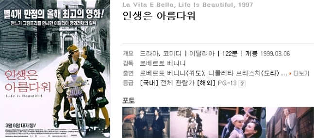
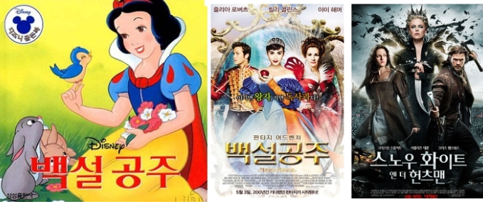
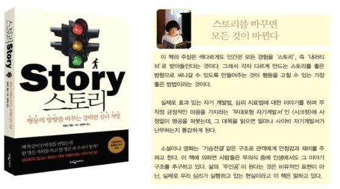
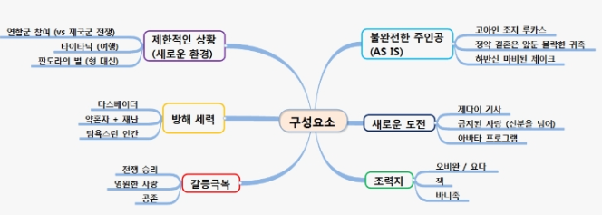

### STORY 
"2차 세계대전 이탈리아, 나치의 유태인 말살정책에 의해 한 남자와 아내, 그리고 어른들 세상의 변화를 아직은 이해할 수 없는 나이의 어린 아들, 이렇게 세식구는 살던 마을을 떠나 유대인 수용소로 강제 수용된다. 자신이 온 곳은 어디이며, 왜 왔는지 궁금해하는 아들을 위해 아버지는 자신들은 게임을 하기위해 선발된 것이며, 이곳에서 게임을 하면서 1,000점을 먼저 따는사람은 탱크을 받게 된다고 이야기해 준다."  

  
[많은 사람들이 이야기를 기억하고 있는 영화 '인생은 아름다워']  

이 이야기는 1997년 개봉한 (국내 1999년 개봉) 영화 '인생은 아름다워' 의 기본 줄거리 입니다. 15년이 지난 이 영화의 기본적인 줄거리는 많은 사람들이 기억하지만 주인공인 바로 그 한 남자의 이름을 기억하는 사람은 많이 않을 것 입니다. 그렇다면 사람은 죽어서 남기는 것은 무엇일까요? 이름? 이야기? 
 
### QUESTION  
이렇듯 우리는 왜 이야기 듣기에 익숙해져 있으며, 또한 흥미를 가지고 목말라하는 것일까요? 이유는 태어나면서 부터 우리는 이야기를 듣는것에 익숙해져 있기 때문입니다.  
*※ 물론 사람의 뇌중 측두엽이 이야기 구조를 잘 기억한다던가, 인지심리학적 이론에서 이미 많이 주장되었던 내용이다.*  

  
[ 어린시절 읽었던 동화 백설공주와 최근 헐리우드에 불고 있는 시리즈들]  

아니 어머니의 뱃 속에서부터 흥미진진한 모험과 사랑 이야기를 느끼기 시작하여, 태어나면서 저를 포함하여 이 세상의 모든 부모님들이 그렇듯 읽어 주시는 이야기에 무릎에 앉아서 혹은 잠자리에 누워 그분들의 목소리에 귀기울이며 백설공주을 내쫓고 웃는 계모의 웃음 소리에 움찔하거나, 백마를 탄 왕자님의 등장에 가슴이 두근 거리곤 했기 때문일 것입니다.  

바로 그 이야기를 통해 사랑, 행복, 설래임, 분노 같은 감정을 배워 왔기에 다른 이의 이야기를 듣기를 원하고 이야기를 들음으로써 심리적 공감을 찾는 것은 어찌보면  당연하게 생각됩니다. 이렇게 우리는 사람으로써 느낄수 있는 온갖것들을 어린시절 이야기를 통해서 배워왔던 것입니다. 
 
### NARRATIVE
 
우리가 세상을 인식하는 방식도 바로 '이야기' 입니다.  

위에서 소개해드린 '인생은 아름다워'에서 귀도(아버지)가 아들 조슈아에게 세상의 변화를 이야기로 이해시켜 줍니다. 아들은 이를 믿고 아버지가 이야기준 대로 그토록 갖고 싶었던 탱크를 받기위한 게임으로 수용소에서의 생활을 즐겁게 잘 버텨내며, 마침내 마지막 숨바꼭질 게임 후 다음날 아침 탱크를 선물(?)로 받게 됩니다.  

위에서 언급한 "세상을 이야기로 인식한다"는 사상을 바탕으로 '스토리'라는 책 (티모시 윌슨, 웅진지식하우스) 에서는 이를 이용한 심리학적 행동 개선 방법을 제시하고 있습니다.  

책에서는 사람들은 벌어진 사실에 대해서 이야기로 (Narrative 혹은, Story) 인식하며, 이 이야기를 약간만 외부에서 조정 (Stroy edit) 해 줌으로써 좋은 방향으로 사실을 인식시켜 행동을 개선할 수 있다고 합니다. 예를 들어 대학교에 입학하자 마자 치룬 시험에 D학점을 받은 학생이 '역시 나의 한계는 여기까지인가 보다 고등학교에서 처럼 여기서는 통한지 않나보다' 라고 생각 할 수도 있고, '공부 하는 방식을 옛날 
방식을 그대로 했기 때문에 이렇게 된것 같아, 이제 공부 방식을 바꿔고 이것에 익숙해 지면 성적은 더 좋아질거야' 라고 생각 할 수도 있습니다. 핵심은 후자인 좋은 이야기를 스스로 만들어 낼 수 있도록 (당사자가 눈치채지않고) 주변에서 적절한 도움을 주어야 한다는 것 입니다.  

*※ 이 외 육아와 청소년, 그리고 사회 관계에서의 이야기를 통한 행동 개선 처방전이 더 있다. 개인적으로 초등학생 아이을 둔 아버지로써, 아이들에 대한 행동 교정을 위한 보상과 처벌에 대한 부분은 매우 흥미로왔다. 이제부터라도 아이에게 그들이 이해할 수 있는 이야기로 설명을 해 주어야 겠다.*  

우리가 세상을 이야기로 받아들이고, 바로 그 이야기를 통해 누군가를 설득하거나, 행동을 변하게 할 수 있다면 어떻게 이야기를 만들어서 전달할 것인가는 매우 중요일이 되버렸습니다.  

### TELLING

자신이 하는일에 대해서 사람들이 쉽게 이해할 수 있는 이야기를 만들어 내고, 적절하게 전달한다는 것은 분명 쉬운 일은 아닙니다. 그러나 적절한 이야기 구성폼과 이를 쉽게 정리할 수 있는 도구가 있다면 그렇게 어려운 일 또한 아닙니다.  

흔이 이야기를 함으로써 전달하고자 핵심가치와 이를 대변할 수 있는 주인공, 그 와 상반되는 적대 세력과 조력자, 그리고  적대 세력과의 갈등 속에서 주인공이 조력자의 도움을 통해 핵심 가치를 찾아가는 과정이 있어야 한다고 합니다.  

다시 말해 앞에서 언급한 '인생은 아름다워'의 이야기를 쉽게 기억하고, 그 의미가 잘 전달되었는 이유는 아래와 같은 이야기 구조를 갖고 있기 때문 입니다. 
 
1. **주인공이 처한 제한적인 상황**  : 2차 세계대전
2. **불안전한 주인공**            : 유대인으로 수용소에 갖힘
3. **새로운 도전**               : 수용소의 생활에서 가족과 함께 살아남기 (1,000점을 따기 위한 게임)
4. **조력자**                    : 아버지
5. **방해세력**                  : 나치 (수용소)
6. **갈등극복**                  : 전쟁에서 살아 남음   

이러한 이야기 구조는 '인생은 아름다워' 뿐만 아니라 다른 영화에서도 발견할 수 있습니다.  
하지만 나열식이 아닌 적절한 툴을 이용하여 표현해 보겠습니다.  

  
[스타워즈, 타이타닉, 아바타 에서의 스토리 전개 방식]  
( 2023.3, 그림내 오타 수정 : 조지 루카스 -> 루크 스카이워커 )
 
### MIND MAP

이야기 구조를 잘 표현하고, 구조적이면서 생각의 발생을 쉽게 표현할 수 있으며, 도식화할 수 있는 툴이 있다면 이야기 말들기는 더 쉬워질 수 있습니다.

Mind Map 은 이야기 구조를 표현하는데 아주 훌륭한 툴입니다. 말 그대로 마음의 지도 인데, 이것이 곧 우리가 외부 세계를 인식하는 형상화된 모습이며, 이 형상화 된 모습을 시간의 흐름, 혹은 인과관계 등로 표현한다면 하나의 훌륭한 "STORY" 가 만들어 질 수 있기 때문 입니다.

  
[마인드맵은 토니 부잔이 1960년대 만들어 학교 및 IBM, 골드만삭스, 보잉, GM 등 글로벌 기업들이 사원교육에 활용중이다.]  

위 그림은 Mind Map을 설명한 간단한 Mind Map 입니다. 단순하게 나열하는 설명보다 도식화된 요소들이 쉽게 눈에 들어 오고, 보는 사람에 따라 그림을 보고 쉽게 적절한 이야기로 설명할 수 있지 않을까요.  

누군가에게 프리젠테이션을 하거나, 보고서를 쓰거나, 적절한 설명이 필요할 때, 이에 알맞는 이야기를 만들어 제공한다면, 그 효과는 매우 클것이라는 것을 우리는 알고 있습니다. 또한 그러한 이야기를 만들기 위해서는 적절한 구성 요소가 갖춰져야 하고, 이를 잘 표현할 수 있는 툴이 있다면 이러한 과정은 생각보다 쉬울 수 있습니다. 
      