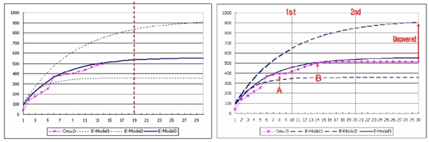
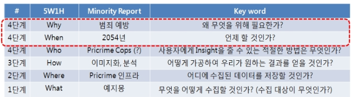
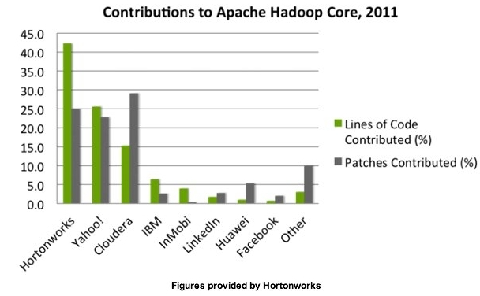
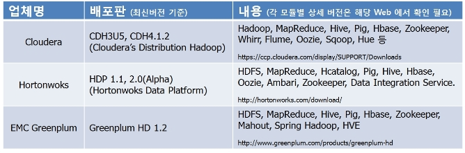
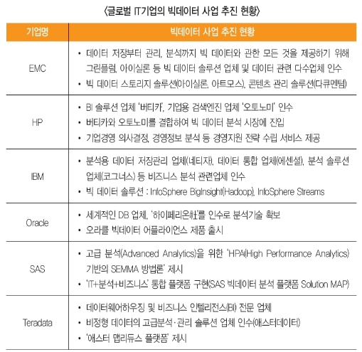
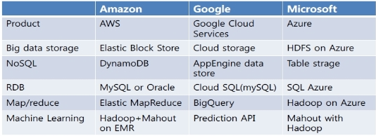
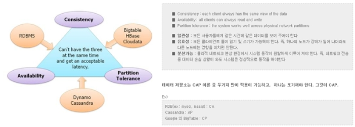
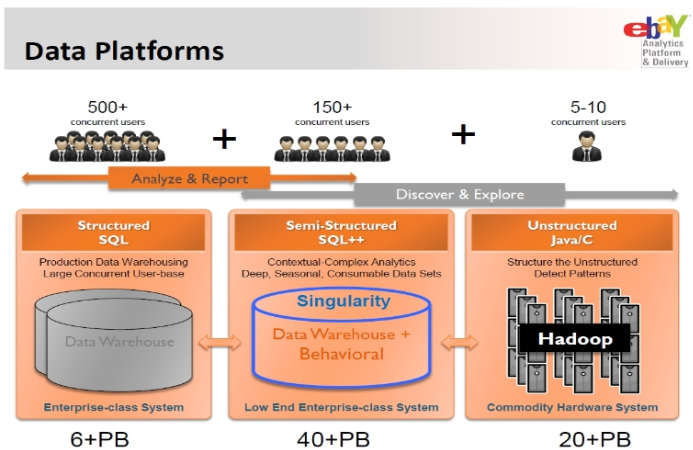

>**"하인리히 슐리만, 옛 트로이, 영화 트로이"**  
*트로이의 발굴자 하인리히 슐리만 (Heinrich Schliemann, 1822 ~ 1890) , 트로이 옛모습, 영화 트로이 : 지금까지 증거가 없다고 모든 것이 다 신화이며 허구인것만은 아니다, 때때로 누군가에 의해 그런 오해는 깨뜨려지기 마련이다.*  

 

엉뚱한 이야기 같지만, 고등학교 시절 '쓰레기 고고학 (Garbage Archaeology)' 라는 것에 흥미를 갖었던 적이 있었다. 쓰레기를 조사하면 그 지역 사람들의 삶과 생활상을 알아낼수 있다는 간단한 논리인데 사춘기였던 그 시절 이것을 접하고 내 방 쓰레기통을 스스로 살펴본 결과, 큰 충격을 받았던 기억이 있다. 누가 보더라도 쉽게 알수 있을 정도로 나의 관심사와 생활들이 쓰레기통에 적나라하게 흔적으로 남아 있었기 때문이다.  

그 때문인지는 모르겠으나 지금까지도 Windows의 쓰레기통 이나, IE의 접속 log를 살펴보는 버릇이 있다. (아들녀석이 무엇을 검색했으며, 어느 사이트에 잘 접속을 하고, 무엇을 보는지... 궁금하기 때문이다. 다행인지 아직 초등5인 아들 녀석은 컴퓨터를 쓴 후 증거를 삭제하는 방법을 모르는듯 하다.)  

 

    이제는 그 동안 우리가 Garbage 로 생각했던, 혹은 Noise 라고 생각했던 Log 파일들, 실패한 실험 데이터, 무수히 많은 기기들에서 발생되는 신호들을 체계적으로 적재하고 분석할 수 있는 기술을 갖게 되었다. (참고 : Minority Report로 풀어보는 Big Data) 그러나 누구에겐 여전히 쓰레기에 불과한 것들 일것이고, 누구에게는 엄청난 가치를 찾아낼 수 있는 원석이 되기도 할 것이다.  

 

## Bit Data

과거의 가시화를 통한 미래예측은 Big Data 분석의 핵심이 되어 버렸다.  

    Big Data라는 단어는 최근에 회자되고 있지만 사실 그 방식은 예전부터 해왔던 일들이다. 단지 대상이 빠르고, 다양하게 커지고 있다는 차이일 뿐이다. 10여년전에 Package SW회사에서 근무했던적이 있었다. Package SW에서 중요한 의사결정 중 하나는 출시시점(RTM : Release To Manufacture) 을 정하는 일이며, 이와 밀접하게 관련된는 판단 요소가 '제품의 품질', 쉽게 말해서 '프로그램에 있는 오류 수'이다. *(Package SW는 MS Office 나 AhnLab V3같이 CD 등 으로 사용자에게 배포되어 PC에 설치, 사용하는 SW를 말한다. 기업에서 업무를 컴퓨터 프로그램화 하는 System Integration 분야와 모발기기 HW에 포함되어지는 Embedded SW 등과 구별된다.)*  

출시전까지 개발팀은 자신이 가지고 있는 모든 역량을 동원하여 가능한 많은 오류를 제거하려 하지만, 과연 제품에 포함된 오류의 총량은 얼마나 되는지, 그 중에 찾을 수 있는 오류는 다 찾은것인지, 고객에게 전달된 오류는 얼마나되며, 그것을 위한 유지보수 인력은 어떻게 준비해야 하는지 등등 에 대한 의문은 여전히 개발 담당자의 육감(?) 혹은 PM의 대담함(?)에 의존할 수 밖에 없었다. 내가 근무했던 회사도 상황은 마찬가지였다. 이미 정해진 출시일까지 밤을 세워가며 최선을 다해 오류를 찾고 수정하는 지루한 작업이 반복될 뿐이였다.  

이를 극복할 수 있는 방법으로 프로젝트를 진행하면서 발생되었던 데이터들를 활용하여 앞으로 프로젝트가 진행될 방향을 예측해보자는 시도가 있었다. '과거 데이터로 가설을 세우고, 이를 현재의 데이터로 보정해 가면 앞으로의 결과를 예측할 수 있다'라는 널리 알려진 방법론을 바탕으로 몇가지 통계모델을 프로젝트 데이터에 적용해 본 결과 프로젝트가 진행되던 약 3/5시점에서 약 98%의 확률로 종료 시점을 예측할 수 있게 되었다.  

아래 그림은 해당 방법론이 적용된 제품의 14주차 시점(왼쪽)의 예측 그래프와 30주차 시점(오른쪽)의 실제  오류 추이 그래프이다. 그래프 상으로 출시 시점을 결정할 수 있는 두번의 기회 (A, B시점)가 있었으며 각각 2주(1st 시점)과 6주 (2nd 시점) 후 출시 가능성을 예측할 수 있었다. (그러나 실제로 30주차에 출시되었고, 우리는 예측이 주는 이익을 얻지는 못했다.) 또한 제품에 총 오류수는 900개이며 그 중 현재 가용한 리소스로 찾을 수있는 오류는 약 550개 정도에 불과한것으로 예상되었다. 그리고 왼쪽 그래프에서 보는 봐와 같이 예상은 비교적 정확했다.  

> *파랑 실선 : 예상 추이 / 빨강 점 실선 : 실제 오류 누적 추이 / 파랑 점선 : 최대, 최소 오류 예상 값*
> *오류가 포함된 제품을 출시한다는 것이 말이 안되는 것일 수도 있으나, 전수검사를 할 수 없다는 점을 가만한다면 이해가 가는 부분이기도 하다. 위 내용은 이 글에서 예시로 사용된 내용이므로 더 자세하게 쓸 수는 없지만 다른 글을 통해 공유할 기회가 있을 것으로 생각한다.*
 
이렇듯 간단하게 입력된 오류수 만을 가지고 통계모델(Rayleigh Model)으로 예측을 한것이지만, 경험에만 의존하던 당신 상황에서는 개발팀에게 그전에 갖지못했던 Insight을 주기에는 충분하였다. 

현재 해당 분야에서 그때는 활용하지 못했던 빠르고, 다양한 용량이 큰 데이터들, 예를 들어 오류를 찾는데 들어간 시간이나, 코드의 변경 정도, 오류 수정시간, 오류 내재기간, 개발팀 내 메일량, 회의 시간 등등 을 가지고 여러가지 실시간 (혹은 배치) 분석 모델로 수백 ~ 수천회 시뮬레이션을 단기간에 할 수 있다는 것이고, 그러므로 더 정확한 예측과 미처 일지 못했던 개발팀의 습관 조차도 알수 있는 시대가 된것이다. 

 

 ## Change with Big Data  
 
 Big Data 는 우리의 업무시스템 환경을 변화시킬 수도 있다.  

    개인적인 의견이지만 이제 정보화 나 SI (System Integration) 접근 방식에도 발상의 전환이 필요할 것이다. 기존의 시스템들 (RDBMS 기반) 은 수집할 수 있는 데이터 중 (혹은 발생시키는 데이터 중) 일부만을 (경영환경에 필요하다고 판단되는) 명확한 필터 (데이터 입력 기준정보) 을 통해서 수집하고, 정해진 구조(Schema)에 적재하는 방식이였다. 그래서 필요할때 마다 그때 그때 따라 다양하게 구축된 DB들은 곧 시스템 그 자체가 되어 버렸다.  

이럴경우 기업경영 환경변화에 따라 추가적인 데이터 (아마도 기준에 부합되여 버려졌던) 수집이 불가능 하게 되여 (이미 버렸기 때문에) 분석할 수 있는 데이터의 한계에 빠져 알고자 했던것만 알 수 밖에 없는 상황이 되었던 것이다. 따라서 이런 RDBMS 중심의 환경에서는 또 다른 DB, 즉 시스템들이 지속적으로 만들어져야만 했고, 때론 사라져야만 했다. (우리 주변에 수많은 비슷한 시스템들의 구축과 폐기로 이를 위한 중복 입력 작업이 늘 떨쳐버릴 수 없었던 이유가 혹시 이 때문은 아닐까?)  

하지만 사전에 아무것도 필터링하지 않고 발생하는 모든것을 기록하여 적재한 다음 (설령 추가 데이터라 필요하더라도 스토리지에 적재후 분석만 다시하면 된다.) 필요에 따라 꺼내서 분석을 할 수 있다면 상황은 상당이 다르게 변할 것이다. 지금까지 (스토리지 운영방식으론 모든것을 기록하기 위해 상당히 많은 비용이 들기 때문에) DB중심으로 중요한 데이터만을 선택하여 적재하고 분석할 수 밖에 없었던 시스템 중심적 (정확하게 RDBMS 중심적) 상황에서 서서히 저 비용의 분산 시스템과 오픈소스의 병렬 분석 SW을 활용하여 데이터 중심(정확하게 데이터의 생산과 소비의 주체인 사람 중심)의 Big Data 시스템으로 변화해야 할 것이다.  

 

    3M이 Post It 이 과거의 실패한 실험으로 부터 나온것은 모두가 잘 알고 있는 사실이다. 비슷한 사례는 이것 말고도 쉽게 찾아 볼 수 있다. 어찌보면 실패한 실험 데이터는 쓰레기로 간주하여 버릴수 있는법한데 그렇게 하지 않은것이다. 만약 이런 실패한 연구 데이터를 모두 저장하고, 나중에 쉽게 찾아 보고, 분석할 수 있는 인프라가 구축 되어 있다면 더 많은 사례들이 나타날 것이며, 따라서 실패가 실패가 아닌 과정으로써 인정받는(?) 분위기가 쉽게 만들어지지 않을까? (또한 퇴직, 전배한 임직원들의 연구 데이터를도 보관/검색/분석 할 수 있다면 더욱 좋을 것이다.)  

> *의료 서비스에서의 사례 ,  출처 :  <시사기획 창>"빅 데이터, 세상을 바꾸다". (2012. 1. 31). 「 KBS 」*
   전체 영상 보기 :  http://news.kbs.co.kr/tvnews/ssam/2012/01/2428163.html  

실험실 장비에서 10초 단위로 발생하는 데이터을 연구원이 30분에 한번씩 실험실에 방문하여 이를 받아 적고, 또 자리로 돌아와 DB에 넣은 후 이를 토대로 분석을 진행하는 경우와 10초 단위로 발생한 모든 데이터를 온라인으로 모아 적재한 다음 이를 분석하는 경우를 비교해 본다면 누가 더 나은 연구결과를 얻을 것인가는 쉽게 상상할 수 있다. 

 

## There is no silver bullet 

: 모든 문제를 한번에 해결할 수는 없다.  

    Big Data가 정보화의 새로운 방향을 제시하는 것 뿐만 아니라 우리의 생활을 변화 시켜줄것이라 것에 대한 많은 사람들이 기대를 하고 있는 것은 사실이지만, 도입하면 모든 문제들이 저절로 술술 풀어지지는 않을 것이다. 관련 자료를 모으고, 정리하는 과정 중에 끊임없이 답을 찾기 위해 맴돌았던 몇가지 질문들을 제시하고 답을 해 봄으로서 비슷한 고민을 하고 있는 분들과 더 깊은 공감을 하고자 한다.   (사실 이것들 말고도 더 증명해야할 질문들은 많다.)  

 

**'우리 조직에도 Big Data 시스템이 필요한가?'**  
: 지금까지 Big Data란 지금까지 경제적 효율성 때문이였던, 혹은 그 엄청난 규모 때문이였던 우리가 눈여겨 보지 않아 버려져야만했던 대상을 저장, 분석할 수 있는 기술과 이를 통해 새로운 의미를 찾고자하는 활동이라 정리하였다. 이제는 우리에게도 필요한가라는 질문으로 그 동안 잊고 간과하고 있던 부분을 짚어 보고 싶다. 

 

    앞서 1편에서 예로 설명했던 'online' 단어찾기의 예를 다시 들어 설명한다면, 새로운 시스템과 방법론으론 지금까지 알 수없었던 'online' 이란 단어와 가장 가까이 있는 단어를 찾을 수는 있지만 그것이 나에게 (찾고자 하는 사람에게) 어떤 의미가 있는가는 또 다른 별개의 문제가 되버린다. 과연 'online' 이란 단어에 가장 가까이 있는 단어가 나에게 어떠한 가치를 줄수 있을 것인가?  여기서 외부 블로거의 말을 인용하여 대신하고자 한다.  (관련 사이트)  

> " 빅데이터라는 말이 굉장히 기술적인 용어같지만, 결국 어떤 트렌디한 말이나 기술이 중요한 것이 아니라, 핵심은 실제로 고객에게 어떤 가치를 줄 것인지를 고민하고 그 가치를 만들어 내는 수단으로 데이터가(사람이 아닌 시스템 단에서 자동으로) 잘 활용될 수 있도록 서비스를 디자인하는 것. 그것이 핵심이라고 생각한다."  

이전글과 연관지어 생각하여 보자. Big Data의 4단계 구성을 5W1H를 맞추어 본다면 아직 언급하지 못한 것은 바로 "Why" 와 "When" 이다. 바로 이부분이 기술이 아닌 사람중심(고객 ?)의 접근이 필요한 부분이라 생각한다.  

>*범죄 예방을 위해서는 예지몽이 아니더라도 또 다른 데이터 소스를 활용하여 범죄예방 시스템을 구축 할 수 있을 것이다. (예: www.crimemapping.com) 그에 따라 필요한 H/W, S/W 그리고 필요인력이 정해질 것이다. 그러나 반드시 그 전에 왜 그것을 정말로 삶에 도움이되는지 고민되어야 한다.*  

 

**'어떻게 Big Data 시스템을 구축할 수 있는가?'**  
: 필요성이 명확하고 무엇을 도움 받을지 결정이 되었다면, 구체적인 구축방법이 필요할 것이다. 아래와 같이 4가지로 분류해 보았다. 먼저 말하고 싶은 것은 자신의 상황에 따라 다양한 방법으로 도입할 수 있다는 것이다. 천편일률적으로 이것이 정답이고, 이것 아니면 도입이 아니다라고 말할 수 없기 때문이다. 솔류션을 제공하는 업체의 특징을 잘 파악하고 자신의 환경에 맞는 서비스를 선택해야 한다.  

 

① Hadoop 기술에 참여, Google, Yahoo, Amazon, Facebook 처럼 일부 Ecosystem에 기여하며 자체 구축 :  
데이터 수집부터 시각화까지 전부 자체적으로 도입하는 방법이다. 주로 아파치 하둡 초기 주도적인 업체들과 이를 활용한 서비스를 제공하는 곳에서 사용한다. 말 그대로 1단계부터 4단계까지 모두 자신의 요구사항에 맞게 도입 (혹은 필요에 따라 추가적인 Ecosystem 모듈을 개발) 하게 된다. 수집 방법부터 분산 시스템 구축, 분석 SW 설치 및 적절한 application 개발까지 결코 쉽거나 단기간에 완성되는 방법이 아니다. 먼저 간단한 가상 분산 시스템을 이용하여 분석 SW을 설치하고 전체적인 프레임웍을 이해하고, 익힌 다음 본인의 업무에 맞은 방식을 찾아내어야 한다.

> **TIP** *[하둡 아파치 프로젝트의 각 업체별 기여도](http://readwrite.com/2011/10/10/hortonworks-responds-counting)*

 

② Hadoop 참여 기업들 중 구축 노하우를 제공하는 업체와 제휴 :  
주요 하둡 선도기업의 노하우, 컨설팅을 통해 도입하는 방법이다. SW 자체가 오픈 소스기 때문에 배포판을 제공하는 업체들은 주로 SW에 대한 수익이 아닌 이를 이용한 컨설팅, 교육으로 수익을 발생시키는 모습입니다. 자신의 조직에서 분산시스템을 갖추고 있거나, 혹은 쉽게 하드웨어 구성(2단계) 하고 이 위에 하둡을 구성하는 방식이다. Cloudera, Hortonworks 등으로 대표 되는 업체들은 자신들이 Hadoop ecosystem의 모듈들을 검증하여 쉽게 사용할 수 있는 배포판을 제공한다. (자신들만의 노하우가 들어간 관리 tool 도 일부 포함된다.)  

> *Open 소스 기반 Hadoop Ecosystem 의  주요 배포 업체 (각 요소별 가용한 버전을 맞추는 번거로움이 없다. 무료이다)*  

 

③ Hodoop 기술이 적용된 기존 HW 기반의 Global Vendor 도입:  
기존 IT업체 중심으로 자신들의 솔류션에 포함하는 형식 혹은 Appliance (HW+SW) 형식으로 제공하는 채택, 도입할 수 있다. Oracle (Big Data Appliance), HP(AppSystem), IBM (Big Insight), EMC (Greenplum Data Computing Appliance) 등 같은 기업들은 분산시스템을 하나의 랙으로 구성한 다음, 위에서 언급한 하둡 배포판 제공업체 (예: Cloudrea) 의 배포한을 설치하여 (혹은 자신들이 직접 구성) 제공하는 형태이다.  

> *표 출처 : (첨부) 빅데이터 기업의 솔류션 및 서비스 추진 현황 (한국정보화진흥원 빅데이터 전략연구센터, 2012.09)*
 *[Big Data 관련 기업](http://www.capgemini.com/technology-blog/2012/09/big-data-vendors-technologies/)* 

 

④ 서비스로써의 Hodoop 사용:  
이미 구축된 2,3단계 시스템을 활용하여 big data 분석 서비스를 사용하는 방식이다. 단, 분석하고 싶은 큰 데이터만 있으면 된다. Google, Amazon 등 H/W와 S/W 의 자체 기술를 보유한 기업들이 제공한다. 최근 미 대선에서 Amazon의 서비스 (AWS) 를 활용한 Big Data 분석은 오마바가 대선에 승리한 주요 요인으로 평가되고 있다. (관련 정보)  

 

**' 은행 계좌 정보도 Big Data 시스템으로 구축 해야 하는가? '**  
: 목표도 있고, 구축 하는 방법도 결정했다면, 지금 사용하는 시스템은 어떻게 해야 하는지 궁금할 것이다. 다시 한번 RDBMS를 비롯한 NoSQL 에 대한 정의(?, 분류) 가 이야기 되어야 할 것 같다. 이를 위해 CAP 이론 (Consistency, Availability, Partition tolerance / 아래표 참고)이 사용되곤 하는데, 간단하게 말한다면 데이터 특성에 따라 적절한 DB 형태가 적용되어야 한다는 것이다. 기존의 중요자료와 새롭게 발견되는 가치있는 정보는 빠르게 접근되어야 하므로 기존의 RDBMS로 유지 될것이다.  

*CAP 이론 (분산시스템이 보장해야할 3가지 특징 중 2가지만 보장할 수 있고, 3가지 모두를 보장하는 것은 불가능 하다는 이론) 에 의한 DB 분류,* 관련 정보1    관련정보2  

아마도 Big Data 시스템의 정형적인 모습은 아래 eBay의 사례처럼 기존의 RDBMS 와 비정형 스토리지 및 NoSQL 이 공존하는 모습이 되지 않을까 생각한다.  

*eBay 의 Data Platforms (출처 Extreme Analytics at eBay, Tom Fastner)*
*1. 엔터프라이즈 데이터 웨어하우스 (EDW): 사용자의 구매이력, 상품의 매출 데이터 등 트랜잭션 데이터(구조화 데이터)를 저장한다.*
*2. 싱귤래리티(Singularity) : 사용자의 행동 이력 등 반구조화 데이터를 저장하는 데이터 웨어하우스.* 
*3. 하둡(Hadoop) : 범용 HW에 하둡 클러스터를 구축, 사용자 행동 이력 데이터나 EDW로 부터 특정 데이터를 복사해추적한다. 주로 텍스트 분석으로 기계학습 어플리케이션을 사용*  

 

마지막으로 영화에서 영원히 완벽할 것으로 생각되었던 Pricriem 시스템이 데이터를 수집함에 있어서 개인의 Privercy 문제(혹은 인권)를 가볍게 생각하여 하루 아침에 사라지게 되었고, 최근에는 스마트폰의 음성 검색 서비스에 대해 I기업에서는 임직원의 해당 서비스 사용를 금지하는 해프닝도 벌어지기도 했다.  (관련기사) Minority Report 로 시작하였으니, Minority Reprot의 결말을 생각해 보면 이미 우리는 Big Data 의 결론을 알고 있는 것은 아닐까? 스스로 "BIG THINK"가 필요한 부분이다.