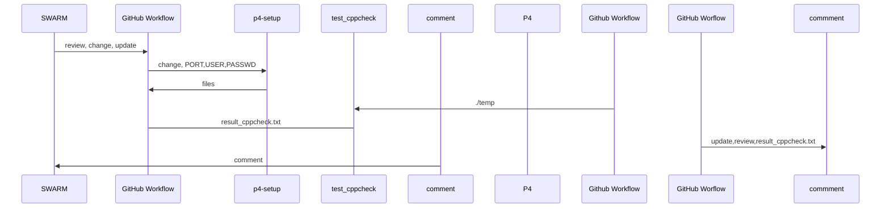

```mermaid
sequenceDiagram
    participant SWARM 
    participant GitHub Workflow
    participant p4-setup
    participant test_cppcheck
    participant comment
    participant P4
    SWARM->>GitHub Workflow: review, change, update
    GitHub Workflow->>p4-setup: change, PORT,USER,PASSWD
    p4-setup->>GitHub Workflow: files
    Github Workflow->>test_cppcheck:./temp
    test_cppcheck->GitHub Workflow: result_cppcheck.txt
    GitHub Worflow->>commment:update,review,result_cppcheck.txt
    comment->>SWARM: comment
```
