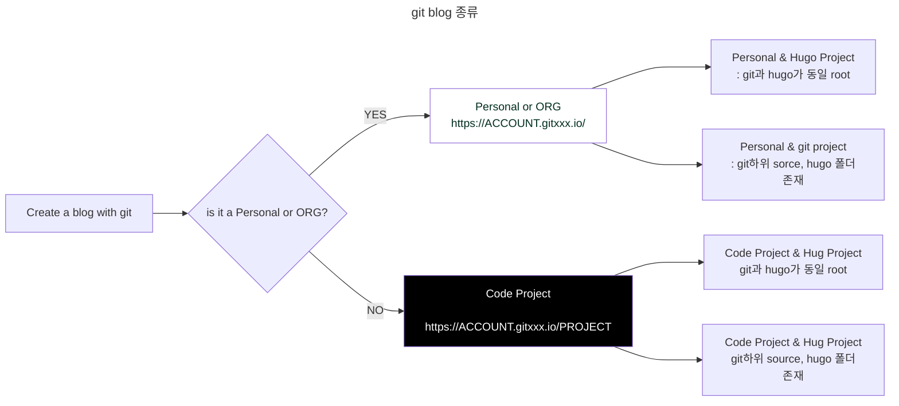
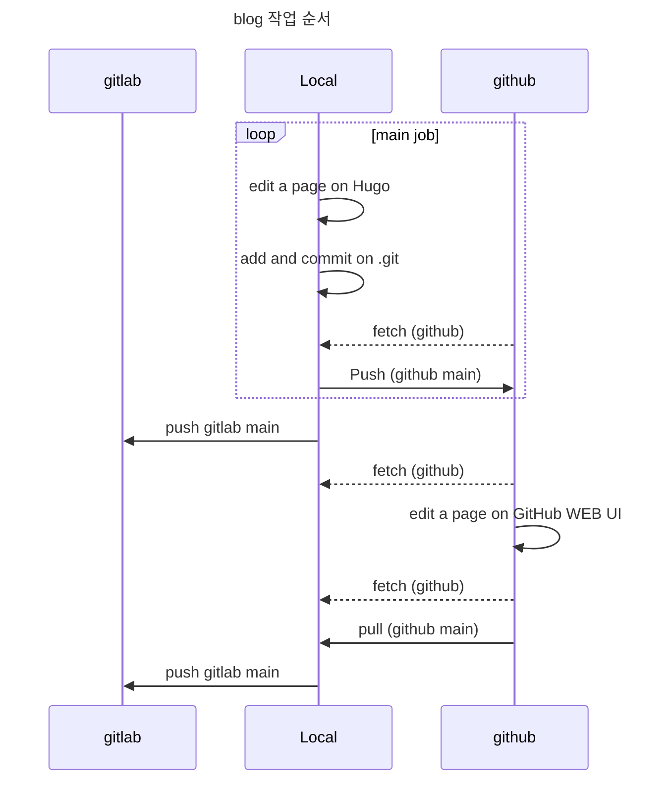

- https://github.com/mermaid-js/mermaid
- https://mermaid-js.github.io/mermaid/#/
- https://mermaid.js.org/syntax/flowchart.html  
- https://mermaid.live  

```mermaid
---
title: git blog 종류
---
  flowchart LR;
      A[Create a blog with git]-->B{is it a Personal or ORG?};      
      classDef white color:#022e1f,fill:#fff;
      classDef black color:#fff,fill:#000;
      
      B--YES-->C["Personal or ORG\n https://ACCOUNT.gitxxx.io/"]:::white;
      C--->E["Personal & Hugo Project\n : git과 hugo가 동일 root"]; 
      C--->F["Personal & git project\n : git하위 sorce, hugo 폴더 존재"];
      
      B--NO-->D["Code Project\n https://ACCOUNT.gitxxx.io/PROJECT"]:::black;
      D--->G["Code Project & Hug Project\n git과 hugo가 동일 root"]; 
      D--->H["Code Project & Hug Project\n git하위 source, hugo 폴더 존재"];
  
```

```mermaid
---
title: blog 작업 순서
---
sequenceDiagram
    participant gitlab
    participant Local 
    participant github
    links gitlab: {"pages": "https://smjune.gitlab.io/"}
    links github: {"Pages": "https:/smjjune.github.io/"}
    loop main job
        Local->>Local: edit a page on Hugo
        Local->>Local: add and commit on .git
        github-->>Local: fetch (github)
        Local->>github: Push (github main)
    end
    Local->>gitlab: push gitlab main
    github-->>Local: fetch (github)
    github->>github: edit a page on GitHub WEB UI
    github-->>Local: fetch (github)
    github->>Local: pull (github main)
    Local->>gitlab: push gitlab main
```
