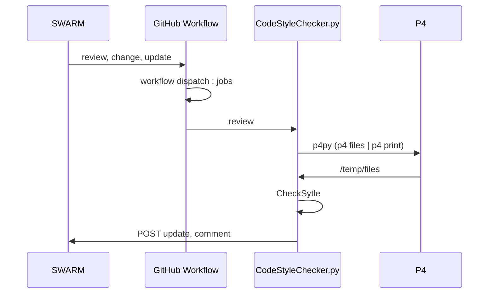

```mermaid
sequenceDiagram
    participant SWARM 
    participant GitHub Workflow
    participant CodeStyleChecker.py
    participant P4
    SWARM->>GitHub Workflow: review, change, update
    GitHub Workflow->>GitHub Workflow:workflow dispatch : jobs
    GitHub Workflow->>CodeStyleChecker.py: review
    CodeStyleChecker.py->>P4: p4py (p4 files | p4 print)
    P4->>CodeStyleChecker.py: /temp/files
    CodeStyleChecker.py->>CodeStyleChecker.py: CheckSytle
    CodeStyleChecker.py->>SWARM: POST update, comment
```
