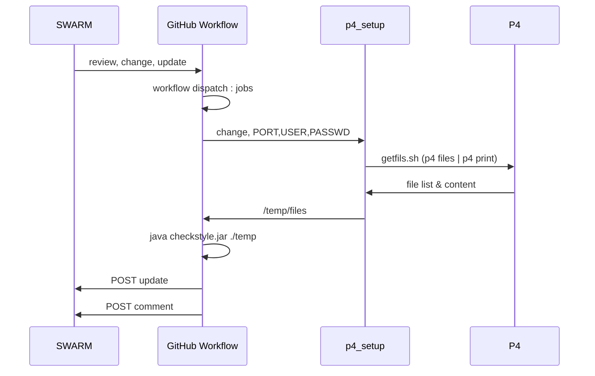

```mermaid
sequenceDiagram
    participant SWARM 
    participant GitHub Workflow
    participant p4_setup
    participant P4
    SWARM->>GitHub Workflow: review, change, update
    GitHub Workflow->>GitHub Workflow:workflow dispatch : jobs
    GitHub Workflow->>p4_setup: change, PORT,USER,PASSWD
    p4_setup->>P4: getfils.sh (p4 files | p4 print)
    P4->>p4_setup: file list & content
    p4_setup->>GitHub Workflow: /temp/files
    GitHub Workflow->>GitHub Workflow: java checkstyle.jar ./temp 
    GitHub Workflow->>SWARM: POST update
    GitHub Workflow->>SWARM: POST comment
```

