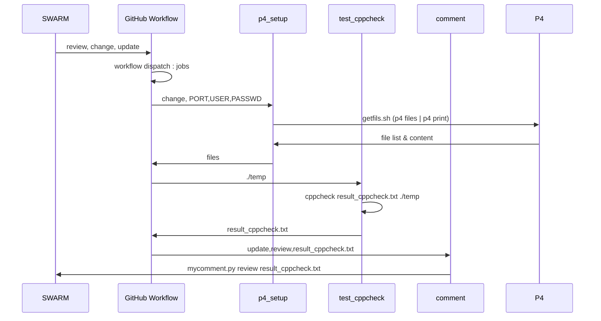
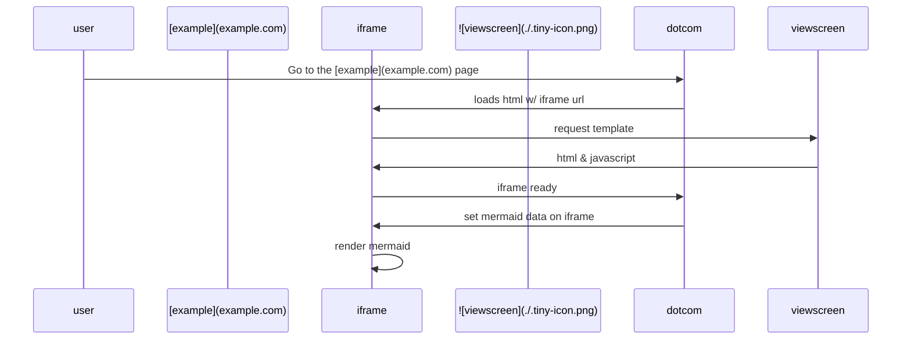

```mermaid
sequenceDiagram
    participant SWARM 
    participant GitHub Workflow
    participant p4_setup
    participant test_cppcheck
    participant comment
    participant P4
    SWARM->>GitHub Workflow: review, change, update
    GitHub Workflow->>GitHub Workflow:workflow dispatch : jobs
    GitHub Workflow->>p4_setup: change, PORT,USER,PASSWD
    p4_setup->>P4: getfils.sh (p4 files | p4 print)
    P4->>p4_setup: file list & content
    p4_setup->>GitHub Workflow: files
    GitHub Workflow->>test_cppcheck:./temp
    test_cppcheck->>test_cppcheck: cppcheck result_cppcheck.txt ./temp 
    test_cppcheck->>GitHub Workflow: result_cppcheck.txt
    GitHub Workflow->>comment:update,review,result_cppcheck.txt
    comment->>SWARM: mycomment.py review result_cppcheck.txt
```

```mermaid
sequenceDiagram
    participant user
    participant [example](example.com)
    participant iframe
    participant ![viewscreen](./.tiny-icon.png)
    user->>dotcom: Go to the [example](example.com) page
    dotcom->>iframe: loads html w/ iframe url
    iframe->>viewscreen: request template
    viewscreen->>iframe: html & javascript
    iframe->>dotcom: iframe ready
    dotcom->>iframe: set mermaid data on iframe
    iframe->>iframe: render mermaid
```
