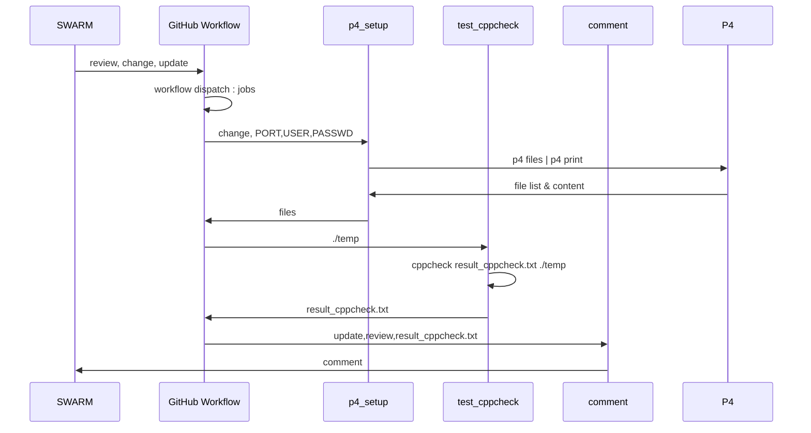

```mermaid
sequenceDiagram
    participant SWARM 
    participant GitHub Workflow
    participant p4_setup
    participant test_cppcheck
    participant comment
    participant P4
    SWARM->>GitHub Workflow: review, change, update
    GitHub Workflow->>GitHub Workflow:workflow dispatch : jobs
    GitHub Workflow->>p4_setup: change, PORT,USER,PASSWD
    p4_setup->>P4: p4 files | p4 print
    P4->>p4_setup: file list & content
    p4_setup->>GitHub Workflow: files
    GitHub Workflow->>test_cppcheck:./temp
    test_cppcheck->>test_cppcheck: cppcheck result_cppcheck.txt ./temp 
    test_cppcheck->>GitHub Workflow: result_cppcheck.txt
    GitHub Workflow->>comment:update,review,result_cppcheck.txt
    comment->>SWARM: comment
```
